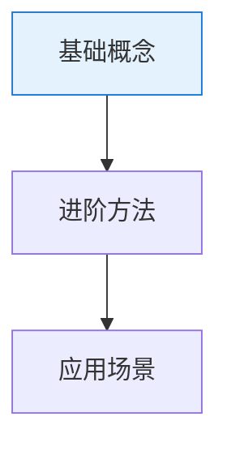

# 生成分类总览与知识图谱（000 文档）

每个系统性分类都必须有一篇 `000-分类总览与知识图谱.md`。本 skill 指导如何生成或更新它。

## 步骤 1：盘点本分类知识点

1. 列出目标分类目录 `docs/NN-分类名/` 下所有 `NNN-知识点.md`（`000` 除外）。
2. 提炼每篇文档的核心知识点，并梳理它们之间的关系：谁是谁的基础、谁由谁组成、学习先后依赖。

## 步骤 2：撰写 000 文档

固定包含以下小节：

```markdown
# 000 · 分类总览与知识图谱

> 本页是「<分类名>」的导读，串联本分类知识点并绘制知识图谱。

## 一、本分类学什么   # 概述 + 指向各 NNN 文档的相对链接
## 二、通俗理解本分类 # 用一个统一类比串起本分类的核心思想
## 三、知识图谱       # Mermaid 图，见下
## 四、学习建议       # 建议阅读顺序 + 配套代码提示
## 五、小结
```

## 步骤 3：绘制知识图谱（关键）

- 使用 Mermaid（```mermaid），本站点已集成渲染。
- 常用：`graph TD` 表达依赖/层次；节点用中文知识点名。
- 箭头必须表达**真实关系**（依赖 / 演进 / 组成），不要只是罗列节点。
- 用 `classDef` 对不同性质的知识点分层着色，增强可读性。示例：



## 步骤 4：与全局总览保持一致

- 若这是新分类，需回到 `docs/00-元规范/000-分类总览与知识图谱.md`，在分类总表与跨分类依赖图谱中补上该分类。

## 步骤 5：校验与预览

- `npm run docs:validate` 校验（确保存在 `000-` 文档）。
- `npm run dev` 预览，确认知识图谱正确渲染、链接有效。
