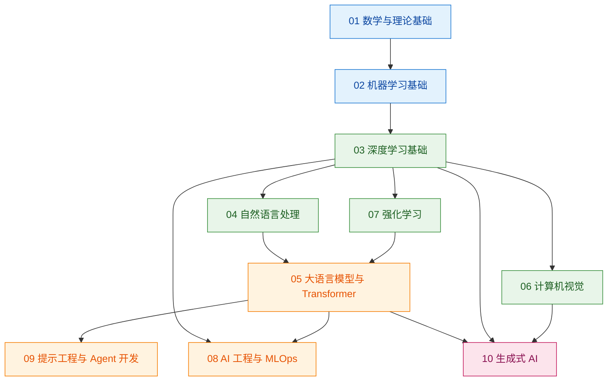
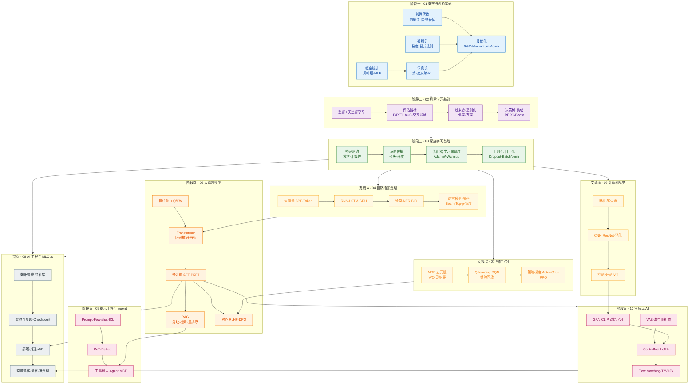
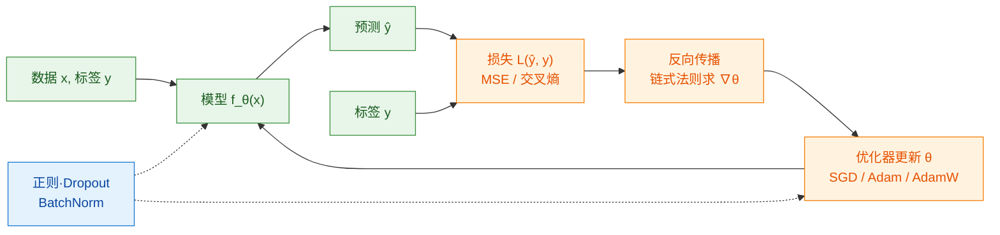

# 000 · 分类总览与知识图谱

> 本页是整个「AI 开发学习知识库」的入口地图。它回答三个问题：**知识库怎么分类、各分类之间如何关联、每篇文档要写成什么样。**

## 一、知识库定位

本仓库用于**系统性地学习 AI 开发**，以文档为主，配套少量用于学习/测试的代码。所有文档遵循统一的质量与结构规范（详见 [001 · 文档编写规范](./001-文档编写规范.md)、[002 · 目录与命名规范](./002-目录与命名规范.md) 与 [003 · 专有名词与术语表](./003-专有名词与术语表.md)）。

### 本分类（00 · 元规范）文档索引

| 序号 | 文档 | 说明 |
| --- | --- | --- |
| 000 | 本页 | 全库分类总览与跨分类知识图谱 |
| 001 | [文档编写规范](./001-文档编写规范.md) | 六条硬性要求与通俗写作三步法 |
| 002 | [目录与命名规范](./002-目录与命名规范.md) | 目录结构、文件命名与校验规则 |
| 003 | [专有名词与术语表](./003-专有名词与术语表.md) | 全库专有名词汇总：中文为主、英文为辅，通俗 + 专业释义 |

## 二、系统性分类总览

知识库按「从理论基础 → 核心方法 → 应用方向 → 工程落地」的学习路径分层，每个分类是一个独立目录：

| 序号 | 分类目录 | 覆盖主题 |
| --- | --- | --- |
| 00 | `00-元规范` | 文档规范、目录命名、写作标准（本分类） |
| 01 | `01-数学与理论基础` | 线性代数、概率统计、微积分、信息论、最优化 |
| 02 | `02-机器学习基础` | 监督/无监督学习、评估指标、过拟合与正则化 |
| 03 | `03-深度学习基础` | 神经网络结构、反向传播、优化器、正则化技巧 |
| 04 | `04-自然语言处理` | 词向量、序列模型、注意力、文本分类与生成 |
| 05 | `05-大语言模型与Transformer` | Transformer、预训练与微调、RAG、推理与对齐 |
| 06 | `06-计算机视觉` | 卷积网络、目标检测、分割、视觉大模型 |
| 07 | `07-强化学习` | 马尔可夫决策过程、值/策略方法、RLHF |
| 08 | `08-AI工程与MLOps` | 数据管线、训练与部署、监控、成本与性能 |
| 09 | `09-提示工程与Agent开发` | 提示设计、工具调用、Agent 架构与评估 |
| 10 | `10-生成式AI` | 扩散、GAN、CLIP、ControlNet、LoRA、Flow Matching |

> 分类可以随学习进度增补，但必须遵循「两位数序号 + 分类名」的目录命名，并在新增分类时补齐本表与下方图谱。

## 三、知识图谱：分类之间的依赖关系

下图展示各分类的**学习依赖关系**（箭头表示"建议先掌握"）。每个分类内部还有自己的细粒度知识图谱，见各分类的 `000` 文档。

## 四、全库核心知识点串联图

上一节是**分类级**依赖（先学哪一大块）。本节把各分类里的**关键知识点**串成一张总图：箭头表示「建议先掌握 / 直接支撑 / 自然延伸」，方便你回答：**学 A 是为了理解 B，B 又通向 C**。

> **怎么读图**：从左到右、从下到上是推荐学习方向；同一 `subgraph` 框内是同一阶段；框与框之间的箭头是跨分类串联。**点击任意 Mermaid 图可全屏放大**，滚轮缩放、拖拽平移，按 `Esc` 或点「关闭」退出。每个分类内部的细粒度图谱见该目录下的 `000-分类总览与知识图谱.md`（01–10 各有一篇）。

### 4.1 分层串联：从数学地基到 Agent / 生成 / 工程

### 4.2 通用训练闭环（所有监督 / 深度学习共用）

无论分类、回归还是 LLM 微调，**「怎么让模型学会」**都绕不开下面这条闭环；03 分类讲的就是把环上每一环拆开讲清：

> **对齐**：绿色是前向（推理），橙色是反向（训练），蓝色虚线是稳定训练、防过拟合的辅助手段。RLHF 里「奖励模型 + PPO」是在此闭环外包了一层**人类偏好**；扩散模型则是把「预测 ŷ」换成「预测噪声 ε」。

### 4.3 三条推荐串联路径

按目标选路径，不必一次读完 10 个分类：

| 路径 | 适合谁 | 串联顺序（读各分类 000 → 001…） |
| --- | --- | --- |
| **A · 对话 / Agent** | 想做 ChatGPT 类应用 | 01 → 02 → 03 → 04 → **05** → **09** → 08（部署） |
| **B · 文生图 / 视频** | 想做 Stable Diffusion / LoRA | 01 → 02 → 03 → 06（可选）→ **05**（CLIP 条件）→ **10** → 08（推理优化） |
| **C · 表格 ML / 传统建模** | 风控、推荐、结构化数据 | 01 → **02**（重点）→ 03（了解即可）→ 08（管线与监控） |

**横向串联关系（跨路径也会相遇）**：

| 从 | 到 | 为什么串在一起 |
| --- | --- | --- |
| 01 交叉熵 | 02 逻辑回归 / 03 分类损失 | 同一套「猜错就罚」的数学语言 |
| 03 反向传播 | 04–06 各架构 | RNN/CNN/Transformer 只是 `f_θ` 换形状 |
| 04 语言模型 | 05 Transformer | 从 RNN 接龙升级到注意力接龙 |
| 05 RAG | 09 工具调用 | 都是「先查外部再生成」，一个查库、一个调 API |
| 05 LoRA / PEFT | 10 LoRA | 同一套低秩微调，LLM 与 SD 共用思想 |
| 07 PPO | 05 RLHF | 对齐阶段直接复用策略梯度 |
| 03–05 任意模型 | 08 MLOps | 训完必走部署、监控、成本优化 |

各分类入口：[01 数学](../01-数学与理论基础/000-分类总览与知识图谱.md) · [02 ML](../02-机器学习基础/000-分类总览与知识图谱.md) · [03 DL](../03-深度学习基础/000-分类总览与知识图谱.md) · [04 NLP](../04-自然语言处理/000-分类总览与知识图谱.md) · [05 LLM](../05-大语言模型与Transformer/000-分类总览与知识图谱.md) · [06 CV](../06-计算机视觉/000-分类总览与知识图谱.md) · [07 RL](../07-强化学习/000-分类总览与知识图谱.md) · [08 MLOps](../08-AI工程与MLOps/000-分类总览与知识图谱.md) · [09 Agent](../09-提示工程与Agent开发/000-分类总览与知识图谱.md) · [10 生成式 AI](../10-生成式AI/000-分类总览与知识图谱.md)

## 五、如何使用本知识库

1. **按路径学习**：从 `01` 到 `10` 逐层深入；先读 [§四 全库知识点串联图](#四全库核心知识点串联图) 选一条路径，再进各分类 `000` 总览。
2. **按需检索**：使用站点右上角搜索，或直接定位到对应分类目录；遇到生词先查 [003 · 专有名词与术语表](./003-专有名词与术语表.md)。
3. **贡献文档**：新增/修改文档前，务必阅读 [001 · 文档编写规范](./001-文档编写规范.md)；引入新术语时同步更新 [003 · 术语表](./003-专有名词与术语表.md)，并运行 `npm run docs:validate` 校验命名与结构。

## 六、本分类小结

- 知识库以"分层学习路径"组织，共 11 个系统性分类（含本元规范分类）。
- **§三** 看分类依赖，**§四** 看知识点如何串联；建议按 §4.3 三条路径之一入门。
- 所有文档遵循统一写作与命名规范；全库专有名词见 [003 · 专有名词与术语表](./003-专有名词与术语表.md)。
