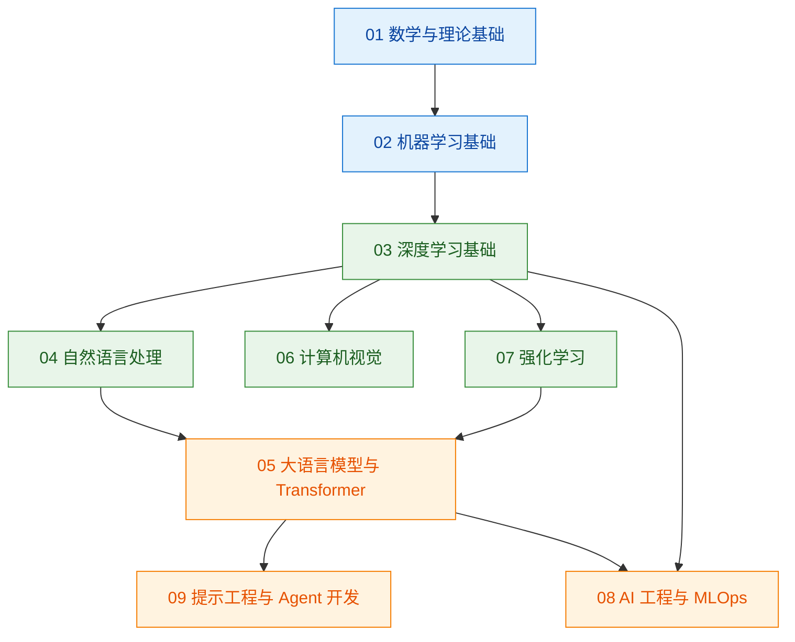

# 000 · 分类总览与知识图谱

> 本页是整个「AI 开发学习知识库」的入口地图。它回答三个问题：**知识库怎么分类、各分类之间如何关联、每篇文档要写成什么样。**

## 一、知识库定位

本仓库用于**系统性地学习 AI 开发**，以文档为主，配套少量用于学习/测试的代码。所有文档遵循统一的质量与结构规范（详见 [001 · 文档编写规范](./001-文档编写规范.md) 与 [002 · 目录与命名规范](./002-目录与命名规范.md)）。

## 二、系统性分类总览

知识库按「从理论基础 → 核心方法 → 应用方向 → 工程落地」的学习路径分层，每个分类是一个独立目录：

| 序号 | 分类目录 | 覆盖主题 |
| --- | --- | --- |
| 00 | `00-元规范` | 文档规范、目录命名、写作标准（本分类） |
| 01 | `01-数学与理论基础` | 线性代数、概率统计、微积分、信息论、最优化 |
| 02 | `02-机器学习基础` | 监督/无监督学习、评估指标、过拟合与正则化 |
| 03 | `03-深度学习基础` | 神经网络结构、反向传播、优化器、正则化技巧 |
| 04 | `04-自然语言处理` | 词向量、序列模型、注意力、文本分类与生成 |
| 05 | `05-大语言模型与Transformer` | Transformer、预训练与微调、RAG、推理与对齐 |
| 06 | `06-计算机视觉` | 卷积网络、目标检测、分割、视觉大模型 |
| 07 | `07-强化学习` | 马尔可夫决策过程、值/策略方法、RLHF |
| 08 | `08-AI工程与MLOps` | 数据管线、训练与部署、监控、成本与性能 |
| 09 | `09-提示工程与Agent开发` | 提示设计、工具调用、Agent 架构与评估 |

> 分类可以随学习进度增补，但必须遵循「两位数序号 + 分类名」的目录命名，并在新增分类时补齐本表与下方图谱。

## 三、知识图谱：分类之间的依赖关系

下图展示各分类的**学习依赖关系**（箭头表示"建议先掌握"）。每个分类内部还有自己的细粒度知识图谱，见各分类的 `000` 文档。

## 四、如何使用本知识库

1. **按路径学习**：从 `01` 到 `09` 逐层深入；每个分类先读 `000` 总览建立全局认知，再按序号读细分知识点。
2. **按需检索**：使用站点右上角搜索，或直接定位到对应分类目录。
3. **贡献文档**：新增/修改文档前，务必阅读本分类下的 [001 · 文档编写规范](./001-文档编写规范.md)，并运行 `npm run docs:validate` 校验命名与结构。

## 五、本分类小结

- 知识库以"分层学习路径"组织，共 10 个系统性分类。
- 分类之间存在明确的依赖关系（见图谱），建议按依赖顺序学习。
- 所有文档遵循统一写作与命名规范，保证系统性、正确性与可读性。
