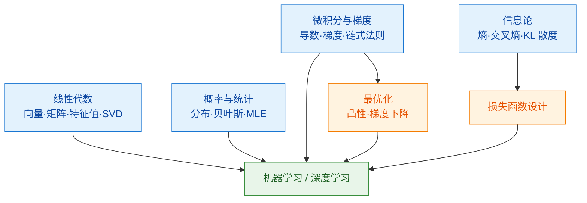

# 000 · 分类总览与知识图谱

> 本页是「数学与理论基础」分类的导读，串联本分类知识点并绘制知识图谱。数学是理解一切 AI 方法的语言。

## 一、本分类学什么

AI/机器学习本质上是"用数学从数据中提炼规律"。本分类打好四大数学支柱 + 一个优化框架：

- 数据与变换的语言——[001 · 线性代数基础](./001-线性代数基础.md)
- 不确定性的语言——[002 · 概率与统计基础](./002-概率与统计基础.md)
- 变化与优化方向的语言——[003 · 微积分与梯度](./003-微积分与梯度.md)
- 信息与损失的语言——[004 · 信息论基础](./004-信息论基础.md)
- 把"学习"变成"求极值"——[005 · 最优化基础](./005-最优化基础.md)

## 二、通俗理解本分类

可以把训练一个模型想成"**在一片起伏的地形上找最低点**"：

- **线性代数**提供描述这片地形所需的坐标与变换（数据是向量，模型是矩阵运算）；
- **概率统计**告诉你数据本身带噪声，规律是"平均意义"上的；
- **微积分**给你"脚下最陡下坡方向"（梯度）；
- **信息论**给你"离目标还有多远"的度量（交叉熵/KL）；
- **最优化**是"如何一步步走到谷底"的整套方法论。

## 三、知识图谱

## 四、学习建议

1. 线性代数与概率统计是"必修基础"，建议最先掌握。
2. 微积分与最优化紧密相关，配合 [03-深度学习基础/002 反向传播与梯度下降](../03-深度学习基础/002-反向传播与梯度下降.md) 一起理解效果最好。
3. 信息论在理解分类损失（交叉熵）与模型对比（KL）时非常关键，可结合具体任务学习。

## 五、小结

- 四大数学支柱（线代、概统、微积分、信息论）+ 最优化，构成 AI 的理论地基。
- 训练模型 = 在带噪数据上，用梯度沿着损失地形走向极值点。
- 打牢本分类后，再学 `02-机器学习基础`、`03-深度学习基础` 会事半功倍。
