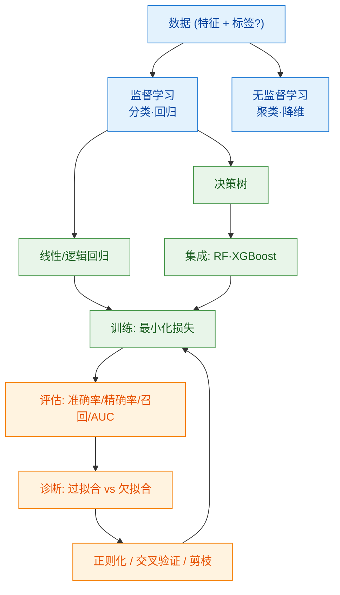

# 000 · 分类总览与知识图谱

> 本页是「机器学习基础」分类的导读，串联本分类知识点并绘制知识图谱。机器学习是深度学习的上位概念与思想源头。

## 一、本分类学什么

机器学习研究"**如何让程序从数据中自动学习规律，而非依赖硬编码规则**"。本分类打通机器学习的完整链路：

- 学习范式全景——[001 · 监督学习与无监督学习](./001-监督学习与无监督学习.md)
- 两个最基础的模型——[002 · 线性回归与逻辑回归](./002-线性回归与逻辑回归.md)
- 如何判断模型好坏——[003 · 模型评估与指标](./003-模型评估与指标.md)
- 为什么模型会"学偏"以及如何纠正——[004 · 过拟合与正则化](./004-过拟合与正则化.md)
- 表格数据强基线——[005 · 决策树与集成方法](./005-决策树与集成方法.md)

## 二、通俗理解本分类

机器学习就像**教小孩认水果**：

- 给他看很多贴了标签的水果（有标签数据）让他学会分类，是**监督学习**；
- 只给一堆没标签的水果让他自己按相似度分堆，是**无监督学习**；
- 用没见过的新水果考他，看他答对多少，是**模型评估**；
- 如果他"死记硬背"了训练水果的每个细节却认不出新水果，就是**过拟合**，需要**正则化**来纠正；
- 再请多位"专家"（多棵树）一起投票或接力纠错，就是**集成学习**，往往比单模型更稳。

## 三、知识图谱

## 四、学习建议

1. 先建立监督/无监督的全局认知，再深入具体模型。
2. 线性/逻辑回归是理解一切模型（含神经网络）的"最小可用样例"。
3. 评估与正则化是**工程落地的关键**，比追求复杂模型更重要。
4. 表格数据任务务必掌握 [005 决策树与集成](./005-决策树与集成方法.md)；配合 `code/02-机器学习基础/` 动手实验（线性回归、评估指标、决策树）。
5. 本分类需具备 [01-数学与理论基础](../01-数学与理论基础/000-分类总览与知识图谱.md) 的概率与最优化知识。

## 五、小结

- 机器学习 = 从数据自动学规律；分监督/无监督两大范式。
- 模型谱系：线性/逻辑回归 → 决策树 → 随机森林 / XGBoost；训练是最小化损失，评估要用没见过的数据。
- 本分类是通往 [03-深度学习基础](../03-深度学习基础/000-分类总览与知识图谱.md) 的直接前置。
