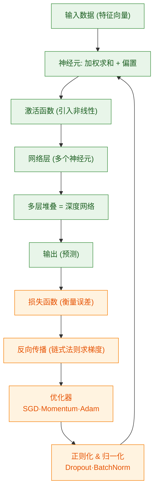

# 000 · 分类总览与知识图谱

> 本页是「深度学习基础」分类的导读，串联本分类知识点，并用知识图谱呈现它们之间的关系。

## 一、本分类学什么

深度学习基础聚焦"**用多层神经网络从数据中自动学习特征**"这一核心思想。掌握本分类后，你应能回答：

- 神经网络由什么组成、为什么"深"比"浅"更强？（见 [001 · 神经网络结构](./001-神经网络结构.md)）
- 网络是如何"学会"的？参数怎么被自动调整？（见 [002 · 反向传播与梯度下降](./002-反向传播与梯度下降.md)）
- 用什么优化器、怎么调学习率才能训得又快又稳？（见 [003 · 优化器与学习率调度](./003-优化器与学习率调度.md)）
- 深层网络怎么防止过拟合、怎么让训练更稳定？（见 [004 · 正则化与批归一化](./004-正则化与批归一化.md)）

## 二、通俗理解本分类

可以把神经网络想象成一条**流水线上的多级质检+加工工序**：原始零件（输入数据）经过一道道工序（网络层），每道工序都做一点变换，最终产出成品（预测结果）。而"训练"就是根据成品的合格程度（损失），**反向回溯**告诉每道工序"你该怎么微调"——再用合适的**优化器**更新参数，并用**正则化与归一化**防止学太野、训练跑偏。

## 三、知识图谱

图中**绿色**为"前向传播（推理）"路径，**橙色**为"训练（学习）"路径。优化器与正则化/归一化是训练闭环里让深层网络**可训、可用**的关键环节。

## 四、学习建议

1. 先读 [001 · 神经网络结构](./001-神经网络结构.md)，建立对"网络由什么组成"的直觉。
2. 再读 [002 · 反向传播与梯度下降](./002-反向传播与梯度下降.md)，理解"网络如何学习"。
3. 接着读 [003 · 优化器与学习率调度](./003-优化器与学习率调度.md) 与 [004 · 正则化与批归一化](./004-正则化与批归一化.md)，掌握工业界训练网络的必备技巧。
4. 配合 `code/03-深度学习基础/` 下的可运行示例动手实验（XOR、梯度下降、优化器对比）。

## 五、小结

- 深度学习 = 多层非线性变换 + 基于梯度的自动参数优化 + 优化器/调度 + 正则化与归一化。
- 前向传播负责"预测"，反向传播 + 优化器负责"学习"，正则化与 BatchNorm 负责"好训、泛化好"。
- 本分类是理解 NLP、CV、LLM 等后续分类的必备基础。
