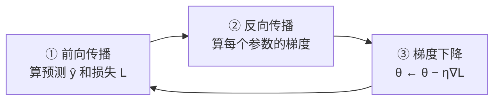

# 002 · 反向传播与梯度下降

> 本文用大白话回答：网络里那么多权重，是怎么被"学"出来的？"反向传播"和"梯度下降"听起来很唬人，它俩到底各干什么活？
>
> **零基础读法**：第二节「蒙眼下山」是全文核心比喻；第三节分三个问题讲清；第四节集中放公式；第五节手算一遍；最后跑 demo 对照数字。

## 一、一句话先说清

- **梯度下降**：**照着"最快下坡的方向"，一小步一小步地把参数往"更好"的方向挪。**
- **反向传播**：**一种高效算出"每个参数该往哪挪、挪多少"的方法。**

配合起来就是：**反向传播负责"算账"（算出每个参数的调整方向），梯度下降负责"花钱"（照着账单更新参数）。** 训练网络就是这俩不停轮流干活。

## 二、打个比方：蒙眼下山

把"训练网络"想象成**蒙着眼睛下山**，目标是走到山谷最低处：

| 下山场景 | 训练网络里的对应 | 含义 |
| --- | --- | --- |
| 你所在的海拔高度 | **损失函数**（衡量预测有多差） | 越低越好 |
| 脚下最陡的上坡方向 | **梯度** | 它的反方向就是"最快下坡" |
| 朝下坡方向迈一小步 | **梯度下降** | 每步把参数挪一点 |
| 怎么快速搞清"这一步往哪迈" | **反向传播** | 不用一个个参数瞎试，一次回溯算清楚 |

- **梯度（gradient）**：可以理解为"当前脚下最陡的上坡方向"。既然要下山（让损失变小），就朝它的**反方向**走。
- **反向传播（backpropagation）**：如果每个参数都单独去试"我改一点损失会怎样"，成本高得离谱。反向传播用**链式法则**，**从输出误差一路往回倒推到每个参数**，一次就把所有参数的"该往哪调"算出来。

## 三、它到底解决什么问题

### 问题 1：怎么知道"当前有多差"

得先有个分数衡量"预测差多少"。回归里常用**均方误差**：预测越偏，分数越高——就像海拔越高。

### 问题 2：知道差多少后，往哪调

参数应朝**让损失下降最快的方向**挪一步。步子大小由**学习率 $\eta$** 控制：太大容易震荡，太小收敛慢（见 [003 优化器](./003-优化器与学习率调度.md)）。

每次用多少数据来算这一步，又分三种：

- **批量梯度下降（BGD）**：用全部样本，稳但慢。
- **随机梯度下降（SGD）**：每次一个样本，快但抖。
- **小批量（Mini-batch）**：一次一小批，工业界主流。

### 问题 3：几百万个参数，梯度怎么高效算

朴素做法：每个权重单独试 → 不可行。**反向传播**从输出层往输入层传**误差信号**，利用链式法则一次算全——计算量与"正着算一遍预测"同量级，这是它高效的根本原因。

训练一次迭代的节奏（全流程）：



## 四、专业视角（与大白话对齐）

### 4.1 损失函数

单样本均方误差（回归示例）：

$$
L = \frac{1}{2}(\hat{y} - y)^2
$$

> 对齐：$\hat{y}$ 是预测，$y$ 是真实值——这就是"海拔高度"。

对所有样本平均：$J(\theta) = \frac{1}{m}\sum_{i=1}^{m} L^{(i)}$（$\theta$ 为全部权重与偏置）。

### 4.2 梯度下降更新

$$
\theta \leftarrow \theta - \eta \, \nabla_\theta J(\theta)
$$

> 对齐：$\nabla_\theta J$ 是最陡**上坡**方向，加负号即下坡；$\eta$ 是步长。

| 学习率 | 后果 | 类比 |
| --- | --- | --- |
| 太大 | 震荡甚至发散 | 一步迈过山谷 |
| 太小 | 收敛极慢 | 一次挪一厘米 |

### 4.3 反向传播与链式法则

设某层 $z = \mathbf{w}^\top \mathbf{a} + b$，激活 $out = \sigma(z)$，最终损失 $L$。对权重 $w_i$：

$$
\frac{\partial L}{\partial w_i}
= \frac{\partial L}{\partial out}\cdot\frac{\partial out}{\partial z}\cdot\frac{\partial z}{\partial w_i}
= \underbrace{\frac{\partial L}{\partial out}\,\sigma'(z)}_{\text{误差项 }\delta}\cdot a_i
$$

> 对齐："损失 ← 输出 ← 加权和 ← 权重"链上每段影响相乘。

关键：**上一层的 $\delta$ 可由下一层递推**，故从输出层倒传一遍即可——这就是"反向"的含义。

## 五、案例解析：手算一次参数更新

最简单单神经元（无激活）：$\hat{y} = w x + b$，损失 $L=\frac{1}{2}(\hat{y}-y)^2$。

给定 $x=2,\ y=4$，初始 $w=0,\ b=0$，学习率 $\eta=0.1$。

**① 前向：** $\hat{y} = 0$，$L = \frac{1}{2}(0-4)^2 = 8$。

**② 反向：**

$$
\frac{\partial L}{\partial w} = (\hat{y}-y)\,x = -8,\quad
\frac{\partial L}{\partial b} = (\hat{y}-y) = -4
$$

**③ 更新：**

$$
w \leftarrow 0 - 0.1\times(-8) = 0.8,\qquad
b \leftarrow 0 - 0.1\times(-4) = 0.4
$$

**④ 验证：** 新预测 $\hat{y}=0.8\times2+0.4 = 2.0$，新损失 $L=2.0 < 8$ ✔

标准库 demo（逐步打印与上文一致）：

```bash
python code/03-深度学习基础/002-反向传播与梯度下降/gradient_descent.py
```

## 六、常见误区与边界

- **误区："反向传播是一种训练算法"**：不是。它只**算梯度**；更新参数的是梯度下降及 Adam 等优化器。
- **误区："学习率随便设"**：学习率是最关键超参之一。
- **边界·梯度消失/爆炸**：深层网络梯度连乘可能趋近 0 或爆炸，需 ReLU、残差、BatchNorm、梯度裁剪等（见 [004 正则化](./004-正则化与批归一化.md)）。

## PyTorch 可运行示例

安装 CPU 版 PyTorch（仅需一次）：

```bash
pip install -r requirements.txt --extra-index-url https://download.pytorch.org/whl/cpu
```

运行 PyTorch 版（用 `autograd` 自动完成②反向，对照手算）：

```bash
python code/03-深度学习基础/002-反向传播与梯度下降/demo_torch.py
```

**输出应看到**：loss 随 epoch 下降，$w,b$ 趋近使 $\hat{y}\approx 4$ 的值；与第五节手算方向一致。

## 七、一句话总结

- **反向传播算账，梯度下降花钱**，两者轮流迭代把网络练好。
- 损失衡量"有多差"，梯度指"下坡方向"，学习率决定"步子多大"。
- 上一篇：[001 · 神经网络结构](./001-神经网络结构.md)；下一篇：[003 · 优化器与学习率调度](./003-优化器与学习率调度.md)。
