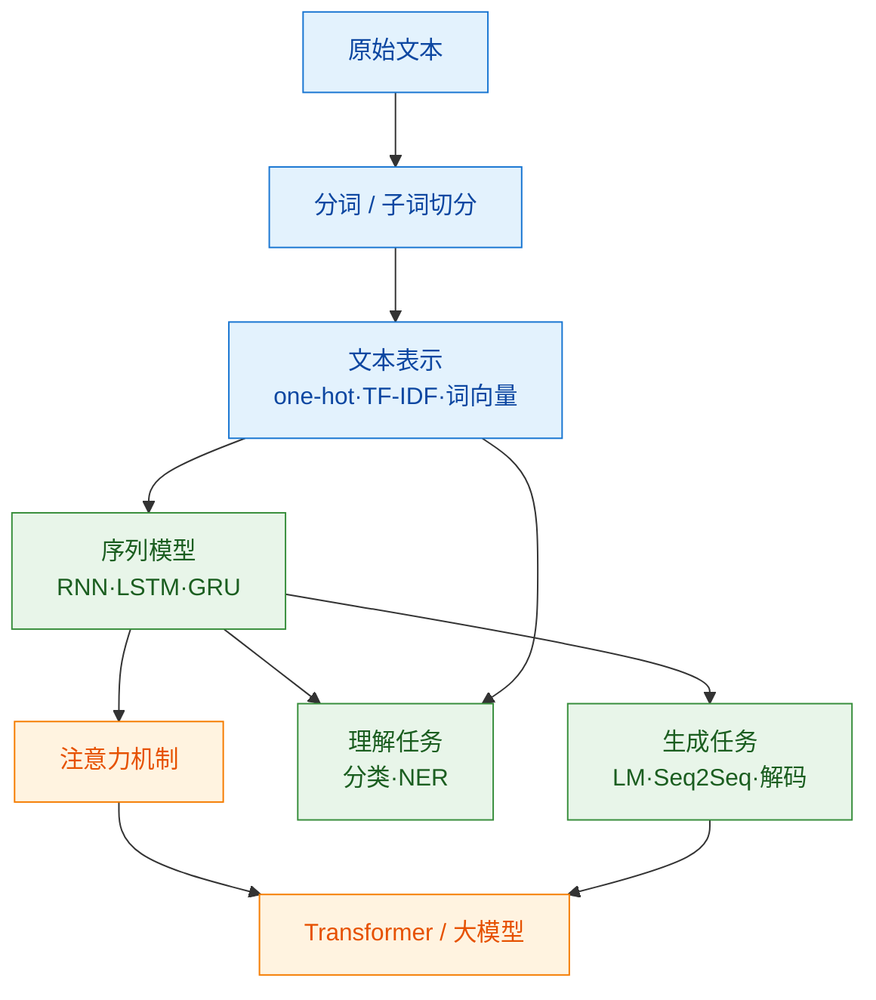

# 000 · 分类总览与知识图谱

> 本页是「自然语言处理（NLP）」分类的导读，串联本分类知识点并绘制知识图谱。本分类聚焦 Transformer 之前的经典 NLP 基础，为理解大模型打底。

## 一、本分类学什么

NLP 研究"**如何让计算机理解与生成人类语言**"。语言是离散、有歧义、有长距离依赖的符号序列，处理它需要一整套技术：

- 怎么把文字变成数字——[001 · 文本表示与词向量](./001-文本表示与词向量.md)
- 怎么把句子切成模型能处理的单元——[002 · 分词与子词切分](./002-分词与子词切分.md)
- 怎么建模序列的时序依赖——[003 · 循环神经网络 RNN 与 LSTM](./003-循环神经网络RNN与LSTM.md)
- 典型理解类任务——[004 · 文本分类与命名实体识别](./004-文本分类与命名实体识别.md)
- 怎么"一个字一个字写下去"——[005 · 文本生成基础](./005-文本生成基础.md)

## 二、通俗理解本分类

让计算机"读懂并写出"语言，要过四关：

1. **翻译成数字**（表示）：计算机不认识"苹果"，得先把词变成向量。
2. **切成合适的块**（分词）：中文没有空格，需要合理切分。
3. **理解顺序与上下文**（序列建模）："我打你"和"你打我"意思相反。
4. **接龙写下去**（生成）：根据前文预测下一个词，拼成完整句子。

## 三、知识图谱

## 四、学习建议

1. 表示与分词是一切 NLP 的入口，务必先掌握。
2. RNN/LSTM 是理解"序列建模"与注意力动机的关键台阶。
3. 理解 [004 分类/NER](./004-文本分类与命名实体识别.md) 与 [005 生成](./005-文本生成基础.md) 的差异：前者给整段贴标签，后者逐 token 接龙。
4. 配合 `code/04-自然语言处理/005-文本生成基础/` 运行字符级语言模型 demo。
5. 学完本分类后进入 [05-大语言模型与Transformer](../05-大语言模型与Transformer/000-分类总览与知识图谱.md)。

## 五、小结

- NLP = 表示 + 切分 + 序列建模 + 理解任务（分类/NER）+ 生成任务（语言模型）。
- RNN/LSTM 擅长时序但难并行；生成与理解共享编码器思想，解码侧是自回归接龙。
- 本分类依赖 [03-深度学习基础](../03-深度学习基础/000-分类总览与知识图谱.md)，是理解大模型的必经之路。
