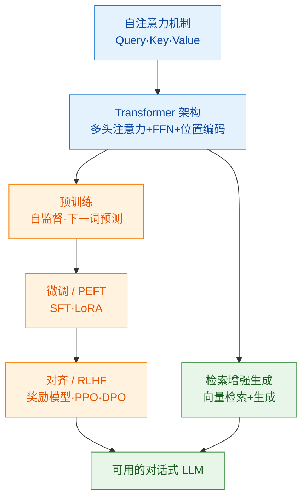

# 000 · 分类总览与知识图谱

> 本页是「大语言模型与 Transformer」分类的导读，串联本分类知识点并绘制知识图谱。

## 一、本分类学什么

本分类沿着"**机制 → 架构 → 训练 → 应用 → 对齐**"的主线，讲清现代大语言模型（LLM）是怎么来的、怎么用的：

- 一切的起点：[001 · 注意力机制与自注意力](./001-注意力机制与自注意力.md)
- 现代 LLM 的骨架：[002 · Transformer 架构](./002-Transformer架构.md)
- 模型如何获得能力：[003 · 预训练与微调](./003-预训练与微调.md)
- 如何让模型用上外部知识：[004 · 检索增强生成（RAG）](./004-检索增强生成RAG.md)
- 如何让模型"听话且安全"：[005 · 对齐与 RLHF](./005-对齐与RLHF.md)

## 二、通俗理解本分类

把一个大语言模型想象成一位**博览群书但需要被调教的实习生**：

- **注意力机制**是它的"阅读理解能力"——读一句话时，能自动关注最相关的词；
- **Transformer** 是它的"大脑结构"；
- **预训练**是"海量自学"，**微调**是"针对岗位的专项训练"；
- **RAG** 是给它配一个"随时可查的资料库"，避免凭记忆瞎编；
- **对齐/RLHF** 是"职业素养培训"，让它按人类偏好、安全地回答。

## 三、知识图谱

## 四、学习建议

1. 先吃透 [001 注意力](./001-注意力机制与自注意力.md) 与 [002 Transformer](./002-Transformer架构.md)，这是理解一切 LLM 的基础（需先具备 [03-深度学习基础](../03-深度学习基础/000-分类总览与知识图谱.md) 的知识）。
2. 再理解 [003 预训练与微调](./003-预训练与微调.md) 的"两阶段范式"。
3. 最后学应用侧的 [004 RAG](./004-检索增强生成RAG.md) 与 [005 对齐](./005-对齐与RLHF.md)。

## 五、小结

- 现代 LLM = 自注意力 + Transformer + 大规模自监督预训练 + 微调/对齐。
- RAG 解决"知识时效与幻觉"，对齐解决"听话与安全"。
- 本分类依赖 `03-深度学习基础`，是通往 `09-提示工程与 Agent 开发` 的桥梁。
