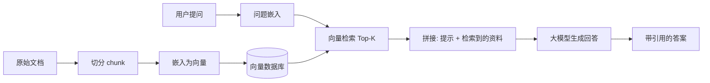

# 004 · 检索增强生成（RAG）

> 本文回答：RAG 要解决什么问题？向量检索如何"按语义找资料"？一个 RAG 系统的完整流程是怎样的？

## 一、直觉与通俗解读

大模型的知识"**冻结在训练那一刻**"，且靠记忆作答容易**一本正经地胡说（幻觉）**。RAG（Retrieval-Augmented Generation，检索增强生成）的思路很朴素：

> **开卷考试**——回答前，先去资料库里查出相关材料，把材料连同问题一起交给模型，让它"照着资料作答"。

这样模型不必"背下所有知识"，而是"**现查现用**"，既能覆盖最新/私有知识，又能显著减少幻觉，还能给出**引用来源**。

## 二、严谨定义与原理

### 2.1 语义检索与嵌入向量

关键词检索靠"字面匹配"，而 RAG 用**嵌入（embedding）** 做**语义检索**：把文本映射为高维向量，语义相近的文本向量也相近。相似度常用**余弦相似度**：

$$
\mathrm{sim}(\mathbf{a},\mathbf{b}) = \frac{\mathbf{a}\cdot\mathbf{b}}{\|\mathbf{a}\|\,\|\mathbf{b}\|}
$$

（点积与范数见 [01-数学与理论基础/001 线性代数](../01-数学与理论基础/001-线性代数基础.md)。）向量存入**向量数据库**，用近似最近邻（ANN）算法快速检索 Top-K。

### 2.2 RAG 的标准流程

分为两个阶段：

1. **离线索引**：文档切分（chunking）→ 嵌入 → 存入向量库。
2. **在线问答**：问题嵌入 → 检索相关 chunk → 与提示拼接 → 交给 LLM 生成。

### 2.3 关键设计点

- **切分粒度**：太大则噪声多、太小则语义不完整，需权衡。
- **Top-K 与重排（rerank）**：先粗召回再用更精细模型重排，提升相关性。
- **提示模板**：明确要求"仅依据给定资料作答，缺乏依据时说明不知道"，进一步抑制幻觉。

## 三、案例解析：企业内部知识库问答

场景：公司想让员工用自然语言查询内部制度（这些内容**不在**大模型训练数据里）。

- **不用 RAG**：直接问模型"公司的报销上限是多少？"→ 模型只能瞎猜或拒答（幻觉风险高）。
- **用 RAG**：先从制度文档中检索到"差旅报销标准"章节，连同问题交给模型 → 模型据此回答"根据《差旅管理制度》第 3 条，报销上限为……"，并给出来源。

**收益**：无需重新训练模型即可接入私有/实时知识，答案可追溯、可更新（改文档即改答案）。

## 四、常见误区与边界

- **误区："RAG 能消除所有幻觉"**：若检索不到相关资料或检索错误，模型仍可能编造；RAG 降低但不根除幻觉。
- **误区："chunk 越大越好"**：过大 chunk 稀释相关信息、浪费上下文预算。
- **误区："RAG 可完全替代微调"**：RAG 擅长注入**知识**，微调擅长塑造**行为/风格/格式**，二者常结合使用。

## 五、小结与延伸阅读

- RAG = "开卷考试"：先语义检索资料，再让模型据此生成，解决知识时效与幻觉。
- 核心是嵌入向量 + 向量数据库 + Top-K 检索 + 提示拼接。
- 相关：[003 · 预训练与微调](./003-预训练与微调.md)（知识 vs 行为）、[09 提示工程与 Agent 开发]（提示模板设计，规划中）。
