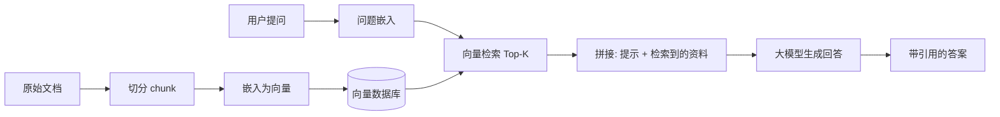

# 004 · 检索增强生成（RAG）

> 本文用大白话回答：RAG 到底要解决什么麻烦？"向量检索"凭什么能"按意思找资料"而不是死抠字面？一套完整的 RAG 系统从头到尾是怎么跑起来的？
>
> 读完你会知道：RAG 说白了就是让大模型"**开卷考试**"——答题前先翻资料，照着资料说话，既能用上最新/私有知识，又能少一本正经地胡说。

## 一、一句话先说清

**RAG（Retrieval-Augmented Generation，检索增强生成）= 让模型回答前先去资料库查出相关材料，把材料连同问题一起喂给它，让它"照着资料作答"。**

大模型有两个天生的软肋：

- 它的知识"**冻结在训练那一刻**"，训练之后发生的事、公司内部的私有资料它都不知道；
- 靠脑子里的记忆硬答，容易**一本正经地胡说八道**（这叫"幻觉"）。

RAG 的思路特别朴素：既然记不全、还爱编，那就别硬背——**现查现用**。

## 二、打个比方：闭卷考试 vs 开卷考试

想象两种考试：

| 考试方式 | 模型怎么答"公司报销上限是多少" | 结果 |
| --- | --- | --- |
| 闭卷考试（不用 RAG） | 只能凭记忆硬答，记不得就编 | 容易瞎猜、幻觉 |
| 开卷考试（用 RAG） | 先翻出《报销制度》那页，照着答 | 有据可依，还能标出处 |

RAG 就是把大模型从"闭卷"改成"**开卷**"：**答题前先查资料，把查到的材料和问题一起交给模型**。这样模型不必"背下所有知识"，而是**现查现用**——既能覆盖最新/私有知识，又能显著减少幻觉，还能给出**引用来源**。

## 三、它到底解决什么问题

**问题 1：怎么"按意思"找资料，而不是死抠字面？**

朴素做法是关键词检索，靠"**字面匹配**"：你搜"报销上限"，文档里写的是"费用报销的最高限额"，字面对不上就搜不到。

| 做法 | 搜"报销上限"，文档写"费用报销最高限额" | 效果 |
| --- | --- | --- |
| 朴素做法：关键词匹配 | 字面不同，匹配不上 | 漏掉相关资料 |
| 更好做法：语义检索 | 意思相近就能找到 | 抓住真正相关的内容 |

解法：用**嵌入（embedding，把文本变成一串能表达"意思"的数字，即向量）**做**语义检索**——意思相近的文本，向量也相近。

**问题 2：资料库那么大，怎么快速找出最相关的几条？**

一篇篇算相似度太慢。解法是把所有资料的向量提前存进**向量数据库**，再用**近似最近邻（ANN）**算法快速捞出最相关的 Top-K（前 K 条）。

**问题 3：模型知识过时、还爱编，怎么让答案可信、可更新？**

| 做法 | 更新知识 / 可信度 | 代价 |
| --- | --- | --- |
| 朴素做法：重新训练模型 | 想更新知识就得重训 | 又贵又慢 |
| 更好做法：RAG | 改文档即改答案，还能附来源 | 无需重训，可追溯 |

解法：把知识放在**外部资料库**里，让模型"照着答、标出处"——**改文档就等于改答案**。

## 四、专业视角（与大白话对齐）

### 4.1 语义检索与嵌入向量

关键词检索靠"字面匹配"，而 RAG 用**嵌入（embedding）**做**语义检索**：把文本映射成高维向量，语义相近的文本，向量也相近。衡量两个向量"像不像"，常用**余弦相似度**：

$$
\mathrm{sim}(\mathbf{a},\mathbf{b}) = \frac{\mathbf{a}\cdot\mathbf{b}}{\|\mathbf{a}\|\,\|\mathbf{b}\|}
$$

> 一句话对齐：这个公式就是量"**两段文本的意思朝不朝一个方向**"——夹角越小、余弦值越接近 1，就越相关。（点积与范数见 [01-数学与理论基础/001 线性代数](../01-数学与理论基础/001-线性代数基础.md)。）

算好的向量存进**向量数据库**，再用**近似最近邻（ANN）**算法快速检索出 Top-K。

### 4.2 RAG 的标准流程

对照着看，整个流程就分两个阶段：

1. **离线索引**（提前把资料库建好）：文档切分（chunking，把长文档切成一小段一小段）→ 嵌入 → 存入向量库。$\to$ 相当于"考前把参考书整理好、贴好标签"。
2. **在线问答**（用户来问时现场做）：问题嵌入 → 检索相关 chunk → 与提示拼接 → 交给 LLM 生成。$\to$ 相当于"考场上翻书、照着写答案"。

### 4.3 关键设计点

- **切分粒度**：切太大则一段里噪声多、切太小则语义不完整，需要权衡。
- **Top-K 与重排（rerank）**：先粗粗召回一批，再用更精细的模型**重排**，把最相关的顶上来。
- **提示模板**：明确要求模型"**仅依据给定资料作答，缺乏依据时就说不知道**"，进一步压住幻觉。

## 五、案例解析：企业内部知识库问答

场景：公司想让员工用自然语言查询内部制度（这些内容**根本不在**大模型的训练数据里）。

- **不用 RAG**：直接问模型"公司的报销上限是多少？"→ 模型只能瞎猜或拒答，幻觉风险高。
- **用 RAG**：先从制度文档里检索到"差旅报销标准"章节，连同问题一起交给模型 → 模型据此回答"根据《差旅管理制度》第 3 条，报销上限为……"，并给出来源。

**收益**：无需重新训练模型，就能接入私有/实时知识；答案还可追溯、可更新（改文档就等于改答案）。

## 六、常见误区与边界

- **误区："RAG 能消除所有幻觉"**：不能。如果压根检索不到相关资料、或检索错了，模型照样会编；RAG 只是**降低**幻觉，不能根除。
- **误区："chunk 越大越好"**：过大的 chunk 会稀释掉真正相关的信息，还白白浪费上下文预算。
- **误区："RAG 可以完全替代微调"**：RAG 擅长注入**知识**，微调擅长塑造**行为/风格/格式**，两者常常要结合使用。

## 七、一句话总结

- RAG = 让模型"**开卷考试**"：先语义检索资料，再照着资料生成，专治知识过时与幻觉。
- 核心四件套：**嵌入向量 + 向量数据库 + Top-K 检索 + 提示拼接**。
- 相关：[003 · 预训练与微调](./003-预训练与微调.md)（知识 vs 行为的分工）、[09 提示工程与 Agent 开发]（提示模板设计，规划中）。
