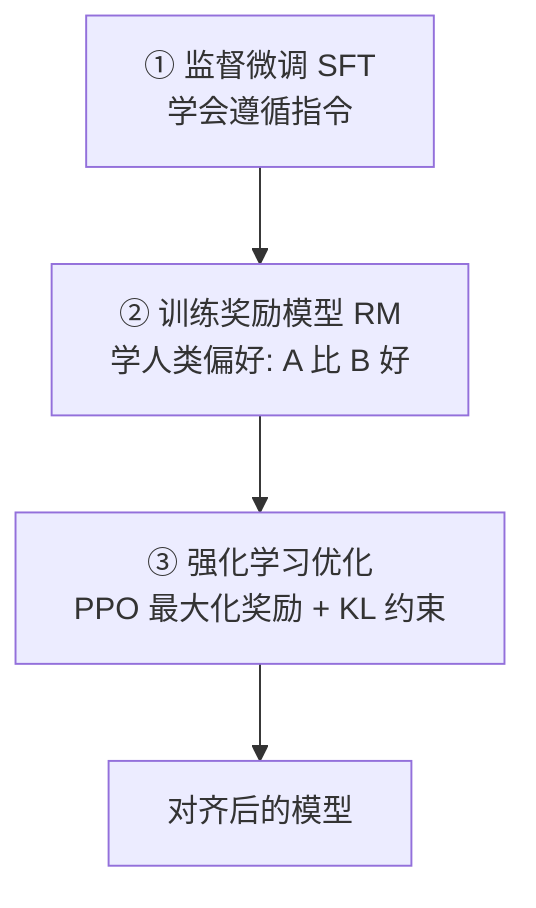

# 005 · 对齐与 RLHF

> 本文用大白话回答："对齐"到底在对齐什么？RLHF 的三步流程是怎么走的？那个 KL 约束为什么非加不可？后来的 DPO 又把哪一步给省了？
>
> 读完你会知道：对齐就是把"能力很强但不贴心"的模型，调教成"有用、诚实、无害"的助手；而 RLHF 干的事，就是"**请人当裁判打分，再让模型学着多拿高分**"。

## 一、一句话先说清

**对齐（alignment）= 让模型的行为符合人类的意图与价值观——有用（helpful）、诚实（honest）、无害（harmless）。**

一个只做过预训练/SFT 的模型，往往"**能力很强但不够贴心**"：回答又臭又长、答非所问，甚至可能蹦出有害内容。对齐要做的，就是把它掰到人类希望的样子上。

而 **RLHF（Reinforcement Learning from Human Feedback，基于人类反馈的强化学习）** 是实现对齐最经典的一套方法。

## 二、打个比方：请人当裁判，让模型学着拿高分

RLHF 的核心思路，用大白话说就是：

> 让人类**比较**模型给的多个回答"**哪个更好**"，据此训练出一个"**打分裁判**"（奖励模型），再用强化学习让模型学会**多产出能拿高分的回答**。

这里有个关键细节：**为什么让人"比较 A 和 B 谁更好"，而不是直接"给个 7.5 分"？**

| 做法 | 让人类干什么 | 靠不靠谱 |
| --- | --- | --- |
| 朴素做法：打绝对分 | 给每个回答打"7.5 分""8 分" | 每人尺度不一，忽高忽低 |
| 更好做法：两两比较 | 只判断"A 比 B 好" | 稳定得多，人更擅长做选择题 |

因为人判断"A 比 B 好"，远比给出一个精确分数**稳定可靠**——这是 RLHF 用"比较"而非"打分"的根本原因。

## 三、它到底解决什么问题

**问题 1：模型能力强，但不知道人类到底喜欢什么样的回答**

预训练/SFT 让模型会说话、会答题，但"什么样的回答算好"这件事，很难用一个损失函数写死。

| 做法 | 怎么告诉模型"好回答长啥样" | 效果 |
| --- | --- | --- |
| 朴素做法：写死规则/标准答案 | 人工枚举规则 | 规则写不全，覆盖不了千变万化 |
| 更好做法：从人类偏好里学 | 让人比较、训练裁判去打分 | 模型能学到"人更喜欢哪种" |

解法：把"人类偏好"变成一个可打分的**奖励模型**，让它替人给回答打分。

**问题 2：一味追求高分，模型会"钻空子"**

如果只让模型拼命最大化裁判给的分，它会学会**投机取巧**——找出裁判打分的漏洞、输出些能骗到高分却读着别扭的怪话。这叫 **reward hacking（钻奖励的空子）**。

| 做法 | 只顾刷奖励分 | 后果 |
| --- | --- | --- |
| 朴素做法：无限最大化奖励 | 模型专挑裁判的漏洞 | 输出偏离正常语言 |
| 更好做法：加 KL 约束 | 限制它别离原来的自己太远 | 既拿高分又说人话 |

解法：加一个 **KL 约束**，拴住模型别跑偏（下面 4.2 细讲）。

## 四、专业视角（与大白话对齐）

### 4.1 RLHF 三阶段

对照第二节的比方，三步是：

1. **SFT（监督微调）**：先用指令数据微调，得到一个"会答题"的初始模型（见 [003](./003-预训练与微调.md)）。$\to$ 相当于"先招一个基本能干活的人"。
2. **奖励模型（RM）**：收集人类对同一问题多个回答的**偏好排序**，训练 RM 学会给回答打分。$\to$ 就是"培养一个打分裁判"。
3. **强化学习（常用 PPO）**：拿 RM 的打分当奖励，去优化语言模型。$\to$ 就是"让模型学着多拿高分"。

### 4.2 为什么需要 KL 约束

前面说，模型只顾刷分就会"钻奖励模型的空子"（reward hacking），输出偏离正常语言。所以在优化目标里，额外加一项"**别离出发点太远**"的惩罚——用它和 SFT 初始策略之间的 **KL 散度（衡量两个概率分布差多远）** 来罚：

$$
\max_{\pi}\ \mathbb{E}_{x\sim\pi}\big[r(x)\big] - \beta\, D_{\mathrm{KL}}\big(\pi \,\|\, \pi_{\text{ref}}\big)
$$

对照着看：

- $r$：奖励（裁判打的分）。$\to$ 前半段就是"尽量多拿高分"。
- $\pi_{\text{ref}}$：参考策略，也就是最开始的 SFT 模型。
- $\beta$：控制约束强度的旋钮，越大管得越严。
- $D_{\mathrm{KL}}(\pi \,\|\, \pi_{\text{ref}})$：现在的模型 $\pi$ 和出发点 $\pi_{\text{ref}}$ 差多远。

> 一句话对齐：这个式子就是"**多拿分（$r$）—— 但别为了拿分把话说得不像人（减去偏离出发点的 KL 惩罚）**"。（KL 散度见 [01-数学与理论基础/004 信息论](../01-数学与理论基础/004-信息论基础.md)。）

### 4.3 DPO：更简单的替代方案

**DPO（Direct Preference Optimization，直接偏好优化）** 把"先显式训练一个奖励模型、再跑强化学习"这套复杂流程**整个跳过**，直接拿偏好数据、用一个类似"分类"的损失去优化模型，**不需要在线采样、也不用调 PPO 那一堆超参**。工程上更稳、更省资源，因此近年被广泛采用。

> 一句话对齐：DPO 就是"**省掉裁判和强化学习那两步，直接用'A 比 B 好'的数据把模型调到位**"。

## 五、案例解析：同一问题的两种回答如何被"排序"

问题："帮我写一封请假邮件。"

- **回答 A**：直接给出格式规范、语气得体、信息完整的邮件。
- **回答 B**：只回一句"你可以写一封邮件请假。"

人类标注者判断 **A ≻ B**（A 优于 B）。奖励模型于是学到"**完整、可用的回答分更高**"；到了强化学习阶段，模型被激励**多产出 A 这类回答**，同时 KL 约束保证它仍然说着正常、连贯的人话，不会为了刷分蹦出奇怪文本。

这正是 ChatGPT 这类模型"**善解人意**"的由来——不是它突然变聪明了，而是它被**对齐**到了人类偏好上。

## 六、常见误区与边界

- **误区："RLHF 让模型更聪明"**：不对。RLHF 主要改变的是**行为偏好和安全性**，基础能力主要还是来自预训练。
- **误区："奖励越高越好"**：过度优化会导致 reward hacking（钻空子），KL 约束正是为治这个而设。
- **误区："对齐一劳永逸"**：对齐存在"**对齐税**"（为了更听话可能牺牲一点能力），而且要持续迭代来应对新出现的风险。

## 七、一句话总结

- 对齐让模型**有用、诚实、无害**；RLHF 用"**人类偏好 → 奖励模型 → 强化学习**"这三步来实现。
- **KL 约束**防止模型偏离正常语言、钻奖励的空子；**DPO** 则用更简单的方式达成对齐。
- 相关：[003 · 预训练与微调](./003-预训练与微调.md)、[01-数学与理论基础/004 信息论](../01-数学与理论基础/004-信息论基础.md)。
