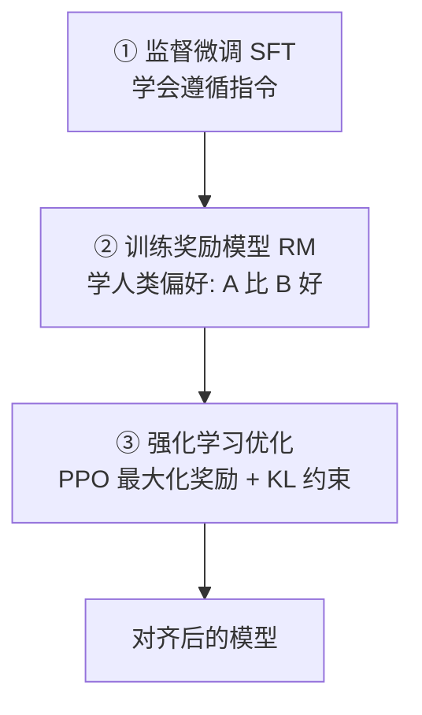

# 005 · 对齐与 RLHF

> 本文回答：什么是"对齐"？RLHF 的三阶段流程是怎样的？为什么需要 KL 约束？DPO 又简化了什么？

## 一、直觉与通俗解读

一个只做过预训练/SFT 的模型，可能"能力很强但不够贴心"：回答冗长、答非所问，甚至输出有害内容。**对齐（alignment）** 就是让模型的行为**符合人类的意图与价值观**——有用（helpful）、诚实（honest）、无害（harmless）。

**RLHF（基于人类反馈的强化学习）** 的核心思路：

> 让人类**比较**模型的多个回答"哪个更好"，据此训练一个"**打分裁判**"（奖励模型），再用强化学习让模型学会**多产出高分回答**。

为什么用"比较"而不是"打绝对分"？因为人类判断"A 比 B 好"远比给出"7.5 分"稳定可靠。

## 二、严谨定义与原理

### 2.1 RLHF 三阶段

1. **SFT**：先用指令数据微调，得到会答题的初始策略（见 [003](./003-预训练与微调.md)）。
2. **奖励模型（RM）**：收集人类对同一问题多个回答的**偏好排序**，训练 RM 给回答打分。
3. **强化学习（常用 PPO）**：以 RM 打分为奖励，优化语言模型策略。

### 2.2 为什么需要 KL 约束

若一味最大化奖励，模型会"**钻奖励模型的空子**"（reward hacking），输出偏离正常语言。因此在目标里加入与 SFT 初始策略的 **KL 散度惩罚**，限制模型不要偏离太远：

$$
\max_{\pi}\ \mathbb{E}_{x\sim\pi}\big[r(x)\big] - \beta\, D_{\mathrm{KL}}\big(\pi \,\|\, \pi_{\text{ref}}\big)
$$

其中 $r$ 是奖励，$\pi_{\text{ref}}$ 是参考（SFT）策略，$\beta$ 控制约束强度。（KL 散度见 [01-数学与理论基础/004 信息论](../01-数学与理论基础/004-信息论基础.md)。）

### 2.3 DPO：更简单的替代方案

**DPO（Direct Preference Optimization，直接偏好优化）** 跳过"显式训练奖励模型 + 强化学习"的复杂流程，直接用偏好数据以一个分类式损失优化策略，**无需在线采样与 PPO 调参**，工程上更稳定、更省资源，是近年广泛采用的对齐方法。

## 三、案例解析：同一问题的两种回答如何被"排序"

问题："帮我写一封请假邮件。"

- 回答 A：直接给出格式规范、语气得体、信息完整的邮件。
- 回答 B：只回一句"你可以写一封邮件请假。"

人类标注者判断 **A ≻ B**（A 优于 B）。奖励模型学到"完整、可用的回答分更高"；随后强化学习阶段，模型被激励**更多产出 A 这类回答**，同时 KL 约束保证它仍说着正常、连贯的语言，不会为了刷分输出奇怪文本。

这正是 ChatGPT 类模型"善解人意"的由来——不是它突然更聪明，而是它被**对齐**到了人类偏好上。

## 四、常见误区与边界

- **误区："RLHF 让模型更聪明"**：RLHF 主要改变**行为偏好与安全性**，基础能力主要来自预训练。
- **误区："奖励越高越好"**：过度优化会 reward hacking，KL 约束正是为此而设。
- **误区："对齐一劳永逸"**：对齐存在"对齐税"（可能牺牲部分能力）且需持续迭代应对新风险。

## 五、小结与延伸阅读

- 对齐让模型有用、诚实、无害；RLHF 用"人类偏好 → 奖励模型 → 强化学习"实现。
- KL 约束防止模型偏离正常语言、钻奖励空子；DPO 用更简单的方式达成对齐。
- 相关：[003 · 预训练与微调](./003-预训练与微调.md)、[01-数学与理论基础/004 信息论](../01-数学与理论基础/004-信息论基础.md)。
