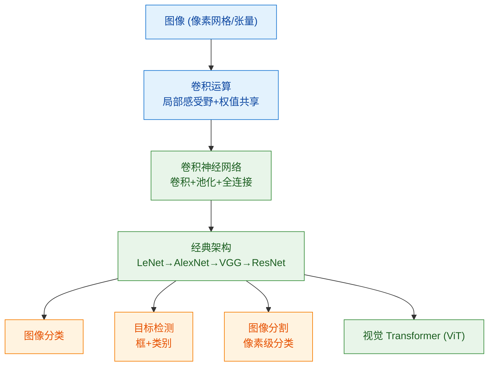

# 000 · 分类总览与知识图谱

> 本页是「计算机视觉（CV）」分类的导读，串联本分类知识点并绘制知识图谱。

## 一、本分类学什么

计算机视觉研究"**如何让机器从图像/视频中理解世界**"。本分类沿"表示 → 模型 → 架构 → 任务"展开：

- 图像在计算机里长什么样、卷积在做什么——[001 · 图像表示与卷积运算](./001-图像表示与卷积运算.md)
- 视觉模型的主力结构——[002 · 卷积神经网络 CNN](./002-卷积神经网络CNN.md)
- 里程碑架构与残差思想——[003 · 经典 CNN 架构与残差网络](./003-经典CNN架构与残差网络.md)
- 从"这是什么"到"在哪里、是哪块"——[004 · 目标检测与图像分割](./004-目标检测与图像分割.md)

## 二、通俗理解本分类

一张图片在计算机眼里就是一个**数字网格**（每个像素是几个数）。计算机视觉要做的是从这堆数字里读出含义：

- **卷积**像用一个"**小滤镜**"在图上滑动，专门检测某种局部花纹（边缘、纹理、部件）；
- 多层卷积**层层抽象**：底层看边缘，中层看部件，高层看整体物体；
- 不同任务问不同问题：**分类**问"这是什么"，**检测**问"有什么、在哪"，**分割**问"每个像素属于谁"。

## 三、知识图谱

## 四、学习建议

1. 先理解卷积运算与感受野，这是 CV 的第一性原理。
2. 沿经典架构的演进理解"为什么要更深、残差如何让深层可训练"。
3. 检测与分割是应用主力，理解其评价指标（IoU/mAP）很重要。
4. 本分类依赖 [03-深度学习基础](../03-深度学习基础/000-分类总览与知识图谱.md)。

## 五、小结

- CV = 把图像张量经卷积层层抽象，再服务于分类/检测/分割等任务。
- 卷积的"局部连接 + 权值共享"是其高效与有效的关键归纳偏置。
- ResNet 的残差思想让"很深"的网络可训练，是现代视觉的转折点。
