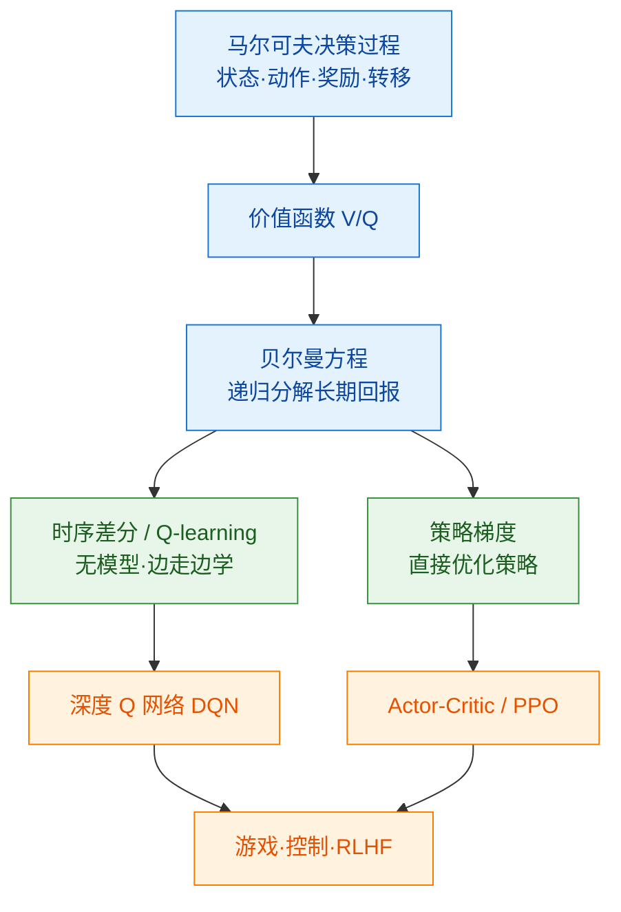

# 000 · 分类总览与知识图谱

> 本页是「强化学习（RL）」分类的导读，串联本分类知识点并绘制知识图谱。

## 一、本分类学什么

强化学习研究"**智能体如何在与环境的交互中，通过试错学会最大化长期回报**"。它是继监督/无监督之后的第三大范式，也是 RLHF、游戏 AI、机器人控制的核心：

- 用数学框架描述"决策问题"——[001 · 马尔可夫决策过程 MDP](./001-马尔可夫决策过程MDP.md)
- 如何评估"当前处境有多好"——[002 · 价值函数与贝尔曼方程](./002-价值函数与贝尔曼方程.md)
- 不知道环境规则也能学——[003 · Q 学习与时序差分](./003-Q学习与时序差分.md)
- 直接优化行为策略与深度 RL——[004 · 策略梯度与深度强化学习](./004-策略梯度与深度强化学习.md)

## 二、通俗理解本分类

强化学习就像**训练小狗**：

- 小狗（**智能体**）在环境里做动作，做对了给零食（**奖励**），做错了没有；
- 它不知道"规则手册"，只能**不断试错**，逐渐学会"在什么情况下做什么最容易得到零食"；
- 它要的不是"这一口零食"，而是**长期总零食最多**（长期回报），所以有时会忍住眼前小利去换更大回报。

## 三、知识图谱

## 四、学习建议

1. MDP 是一切 RL 的语言，务必先吃透"状态-动作-奖励-转移"四要素。
2. 价值函数与贝尔曼方程是核心数学工具，是理解所有算法的基础。
3. 分清两大流派：**基于价值**（Q-learning/DQN）与**基于策略**（策略梯度/Actor-Critic）。
4. 本分类需具备 [01-数学与理论基础](../01-数学与理论基础/000-分类总览与知识图谱.md)（概率、期望）与 [03-深度学习基础](../03-深度学习基础/000-分类总览与知识图谱.md)。

## 五、小结

- RL = 智能体在环境中试错、最大化长期回报；用 MDP 建模。
- 两大流派：学价值再导出策略 vs 直接优化策略；深度 RL 用神经网络逼近价值/策略。
- RL 是 [05/005 对齐与 RLHF](../05-大语言模型与Transformer/005-对齐与RLHF.md) 的方法论来源。
