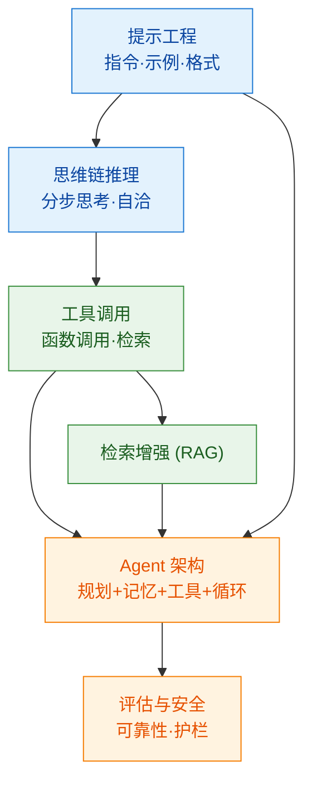

# 000 · 分类总览与知识图谱

> 本页是「提示工程与 Agent 开发」分类的导读，串联本分类知识点并绘制知识图谱。本分类关注"如何用好大模型，并让它自主完成任务"。

## 一、本分类学什么

有了强大的大语言模型，如何**驱动它准确、可靠地完成任务**，乃至让它**自主规划、调用工具、完成复杂目标**？这就是提示工程与 Agent 开发：

- 怎么把话说好让模型听懂——[001 · 提示工程基础](./001-提示工程基础.md)
- 怎么让模型"想清楚再答"——[002 · 思维链与推理](./002-思维链与推理.md)
- 怎么让模型使用外部工具——[003 · 工具调用与函数调用](./003-工具调用与函数调用.md)
- 怎么把这些拼成一个自主智能体——[004 · Agent 架构与评估](./004-Agent架构与评估.md)

## 二、通俗理解本分类

如果大模型是一位**知识渊博的实习生**：

- **提示工程**是"**把任务交代清楚**"——说明背景、要求、格式，他就能干得又快又好；
- **思维链**是"**让他打草稿、分步想**"，而不是脱口而出，从而少犯错；
- **工具调用**是"**给他配电脑和计算器**"——查资料、算数、发请求，弥补他记忆过时、不擅长精确计算的短板；
- **Agent** 则是让他"**自己拆解任务、边做边调整**"，从"你问一句他答一句"升级为"给个目标他自主完成"。

## 三、知识图谱

## 四、学习建议

1. 提示工程是**性价比最高**的技能，先掌握再谈复杂系统。
2. 思维链、工具调用是构建 Agent 的两块基石。
3. Agent 强大但不稳定，**评估与安全护栏**必须同步跟上。
4. 本分类以 [05-大语言模型与Transformer](../05-大语言模型与Transformer/000-分类总览与知识图谱.md) 为基础，并常与 [RAG](../05-大语言模型与Transformer/004-检索增强生成RAG.md) 结合。

## 五、小结

- 提示工程 → 思维链 → 工具调用 → Agent，是"用好大模型"到"让模型自主干活"的进阶路径。
- Agent = 大模型（大脑）+ 规划 + 记忆 + 工具 + 反馈循环。
- 越自主越需要评估与安全护栏，防止不可控行为。
