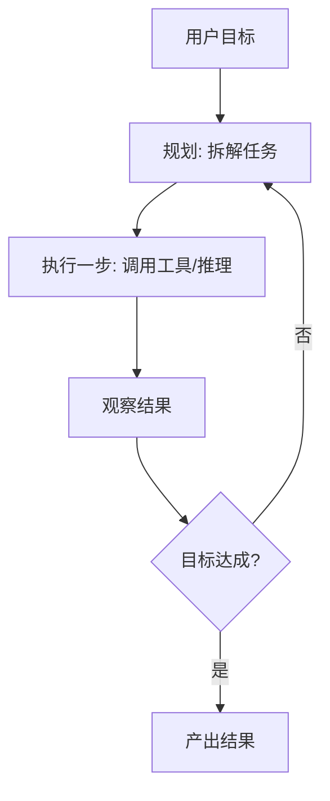

# 004 · Agent 架构与评估

> 本文用大白话回答：AI Agent 和"普通问答"到底差在哪？它由哪几块拼成？为什么说它能"自己把活干完"？既然它这么自主，为什么评估和"安全护栏"反而更重要？

## 一、一句话先说清

**AI Agent（智能体，"能自己拆任务、用工具、边做边调整的执行者"）= 你给一个目标，它自己想办法一步步做完，而不是你问一句它答一句。**

- 普通用法是"**你问一句，模型答一句**"。
- Agent 更进一步：**你给一个目标，它自己拆解任务、调用工具、边做边调整，直到完成**。

## 二、打个比方：一个能干的项目负责人

把 Agent 想象成一个能干的**项目负责人**，你只丢给他一个目标，剩下的他自己张罗：

| 项目负责人怎么做 | Agent 里的对应模块 | 干什么 |
| --- | --- | --- |
| 用脑子想、拿主意 | 大脑（LLM） | 负责思考与决策 |
| 把大目标拆成小任务 | 规划（Planning） | 把大目标拆成一步步小任务 |
| 记住做过啥、学到啥 | 记忆（Memory） | 记住已经做过什么、学到什么 |
| 打电话、查资料、跑腿 | 工具（Tools） | 搜索、代码执行、调 API 等"手脚" |
| 做一步看一步、随时纠偏 | 循环（Loop） | 做一步 → 看结果 → 想下一步，反复直到达成 |

它不再是"一问一答的百科全书"，而是"**能自己把活干完的执行者**"。

## 三、它到底解决什么问题

### 问题 1：复杂目标没法"一句话答完"

"帮我调研某趋势并写摘要"这种目标，一次问答根本兜不住——需要**拆解 + 多步执行**。Agent 的核心就是把几块能力拼起来：

$$
\text{Agent} = \text{LLM（大脑）} + \text{规划(Planning)} + \text{记忆(Memory)} + \text{工具(Tools)} + \text{反馈循环}
$$

- **规划**：任务分解、制定步骤（可用 CoT / ReAct，见 [002](./002-思维链与推理.md)）。
- **记忆**：短期（当前上下文）+ 长期（向量库检索历史，见 [RAG](../05-大语言模型与Transformer/004-检索增强生成RAG.md)）。
- **工具**：通过函数调用与外界交互（见 [003](./003-工具调用与函数调用.md)）。

### 问题 2：任务不能"一锤子买卖"，得边做边纠偏

现实任务常常做一步才知道下一步该干嘛。Agent 靠一个**自主循环（Agent Loop）**不断"感知—决策—行动"：

这是一个"感知-决策-行动"的闭环，ReAct 是其典型实现。

> 对齐前面：这张循环图，正是"项目负责人做一步 → 看结果 → 想下一步"的画面。

### 问题 3：一个人忙不过来的活，可以"组队"

复杂任务可由**多个专职 Agent 协作**（如"规划者 + 编码者 + 审查者"），通过消息传递分工合作。

| 做法 | 单 Agent | 多 Agent |
| --- | --- | --- |
| 适合 | 中小任务 | 需分工的复杂任务 |
| 代价 | 简单 | 带来协调与成本上的复杂度 |

### 问题 4：越自主，越容易"跑偏、烧钱、闯祸"

Agent 越自主，**越难预测、越需要约束**。所以要配两样东西：

- **评估**：衡量它干得好不好——任务成功率、步骤效率、成本（token/调用次数）、鲁棒性。因输出开放，评估常需人工或用"**LLM 作裁判（LLM-as-judge，让另一个大模型来打分**）"。
- **安全护栏（Guardrails，"给自主行为立的规矩栏杆"）**：限制可用工具与权限、对危险操作要人工确认、设置最大步数/预算防止死循环、过滤有害输出、防提示注入。

## 四、专业视角（与大白话对齐）

- **Agent（智能体）**：以 LLM 为决策核心，结合规划、记忆、工具与反馈循环，能自主拆解并执行任务的系统。对齐前面：就是"能自己把活干完的项目负责人"。
- **自主循环（Agent Loop）**：规划 → 执行 → 观察 → 判断是否达成 → （未达成则）回到规划的闭环，ReAct 是典型实现。对齐前面：就是"做一步、看结果、想下一步"。
- **评估与安全护栏**：分别衡量 Agent 的表现（成功率/效率/成本/鲁棒性）与约束其行为（权限、确认、步数与预算上限、输出过滤、防注入）。对齐前面：一个是"考核",一个是"栏杆"。

## 五、案例解析：一个"研究型 Agent"的自主循环

**目标**："帮我调研近期某技术趋势并写一份摘要。"

Agent 的自主执行过程：

1. **规划**：拆成"① 搜索资料 → ② 阅读筛选 → ③ 归纳 → ④ 撰写摘要"。
2. **执行 ①**：调用搜索工具（Thought：我需要最新资料 → Action：search → Observation：得到若干链接）。
3. **执行 ②**：抓取并阅读页面，把要点存入记忆。
4. **执行 ③**：综合记忆中的要点归纳趋势。
5. **判断**：信息是否充分？不足则回到 ①补充搜索（**循环**）。
6. **执行 ④**：充分后撰写结构化摘要，产出结果。

全程无需用户逐步指挥——**给定目标，Agent 自主规划、调用工具、循环迭代直至完成**。同时护栏限定了最大搜索次数与总 token 预算，避免它无休止地"研究"下去。这直观展现了 Agent 相较普通问答的质变，以及为何必须配套评估与护栏。

## 六、常见误区与边界

- **误区："Agent 能可靠完成任意复杂任务"**：当前 Agent 在长链路任务上易累积错误、陷入循环，可靠性仍有限。
- **误区："给足工具就万事大吉"**：缺乏护栏的自主 Agent 可能产生高成本或危险操作。
- **边界**：评估开放式 Agent 很难，成本与稳定性是落地的主要瓶颈。

## 七、一句话总结

- Agent = LLM + 规划 + 记忆 + 工具 + 反馈循环，从"问答"升级为"自主执行"。
- 自主循环（如 ReAct）是核心；多 Agent 协作可处理更复杂任务。
- 越自主越需评估与安全护栏。相关：[002 思维链](./002-思维链与推理.md)、[003 工具调用](./003-工具调用与函数调用.md)、[RAG](../05-大语言模型与Transformer/004-检索增强生成RAG.md)。
