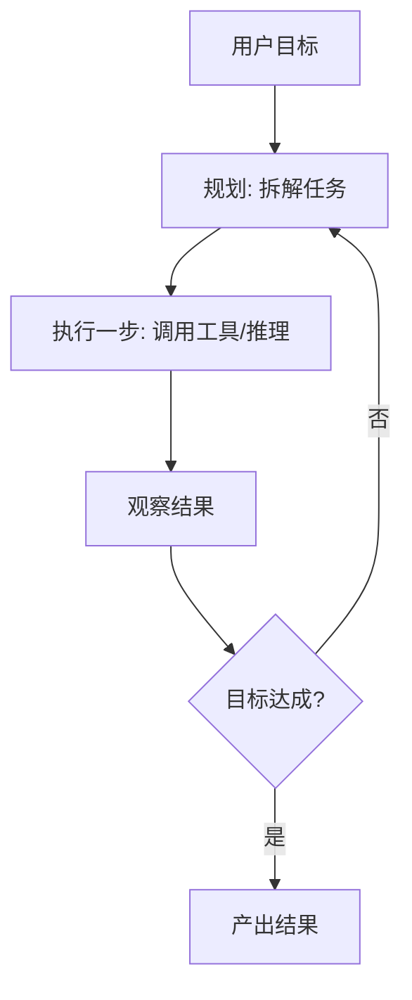

# 004 · Agent 架构与评估

> 本文回答：什么是 AI Agent？它由哪些模块组成？Agent 如何"自主循环"完成任务？为什么评估与安全护栏至关重要？

## 一、直觉与通俗解读

普通用法是"**你问一句，模型答一句**"。**Agent（智能体）** 则更进一步：**你给一个目标，它自己拆解任务、调用工具、边做边调整，直到完成**。

把 Agent 想象成一个能干的**项目负责人**：

- **大脑（LLM）**：负责思考与决策；
- **规划**：把大目标拆成一步步小任务；
- **记忆**：记住已经做过什么、学到什么；
- **工具**：搜索、代码执行、调 API 等"手脚"；
- **循环**：做一步 → 看结果 → 想下一步，反复直到目标达成。

它不再是"一问一答的百科全书"，而是"**能自己把活干完的执行者**"。

## 二、严谨定义与原理

### 2.1 Agent 的核心组成

$$
\text{Agent} = \text{LLM（大脑）} + \text{规划(Planning)} + \text{记忆(Memory)} + \text{工具(Tools)} + \text{反馈循环}
$$

- **规划**：任务分解、制定步骤（可用 CoT / ReAct，见 [002](./002-思维链与推理.md)）。
- **记忆**：短期（当前上下文）+ 长期（向量库检索历史，见 [RAG](../05-大语言模型与Transformer/004-检索增强生成RAG.md)）。
- **工具**：通过函数调用与外界交互（见 [003](./003-工具调用与函数调用.md)）。

### 2.2 自主循环（Agent Loop）

这是一个"感知-决策-行动"的闭环，ReAct 是其典型实现。

### 2.3 单 Agent vs 多 Agent

复杂任务可由**多个专职 Agent 协作**（如"规划者 + 编码者 + 审查者"），通过消息传递分工合作，但也带来协调与成本上的复杂度。

### 2.4 评估与安全护栏

Agent 越自主，**越难预测、越需要约束**：

- **评估**：任务成功率、步骤效率、成本（token/调用次数）、鲁棒性。因输出开放，评估常需人工或用"LLM 作裁判（LLM-as-judge）"。
- **安全护栏（Guardrails）**：限制可用工具与权限、对危险操作要人工确认、设置最大步数/预算防止死循环、过滤有害输出、防提示注入。

## 三、案例解析：一个"研究型 Agent"的自主循环

**目标**："帮我调研近期某技术趋势并写一份摘要。"

Agent 的自主执行过程：

1. **规划**：拆成"① 搜索资料 → ② 阅读筛选 → ③ 归纳 → ④ 撰写摘要"。
2. **执行 ①**：调用搜索工具（Thought：我需要最新资料 → Action：search → Observation：得到若干链接）。
3. **执行 ②**：抓取并阅读页面，把要点存入记忆。
4. **执行 ③**：综合记忆中的要点归纳趋势。
5. **判断**：信息是否充分？不足则回到 ①补充搜索（**循环**）。
6. **执行 ④**：充分后撰写结构化摘要，产出结果。

全程无需用户逐步指挥——**给定目标，Agent 自主规划、调用工具、循环迭代直至完成**。同时护栏限定了最大搜索次数与总 token 预算，避免它无休止地"研究"下去。这直观展现了 Agent 相较普通问答的质变，以及为何必须配套评估与护栏。

## 四、常见误区与边界

- **误区："Agent 能可靠完成任意复杂任务"**：当前 Agent 在长链路任务上易累积错误、陷入循环，可靠性仍有限。
- **误区："给足工具就万事大吉"**：缺乏护栏的自主 Agent 可能产生高成本或危险操作。
- **边界**：评估开放式 Agent 很难，成本与稳定性是落地的主要瓶颈。

## 五、小结与延伸阅读

- Agent = LLM + 规划 + 记忆 + 工具 + 反馈循环，从"问答"升级为"自主执行"。
- 自主循环（如 ReAct）是核心；多 Agent 协作可处理更复杂任务。
- 越自主越需评估与安全护栏。相关：[002 思维链](./002-思维链与推理.md)、[003 工具调用](./003-工具调用与函数调用.md)、[RAG](../05-大语言模型与Transformer/004-检索增强生成RAG.md)。
