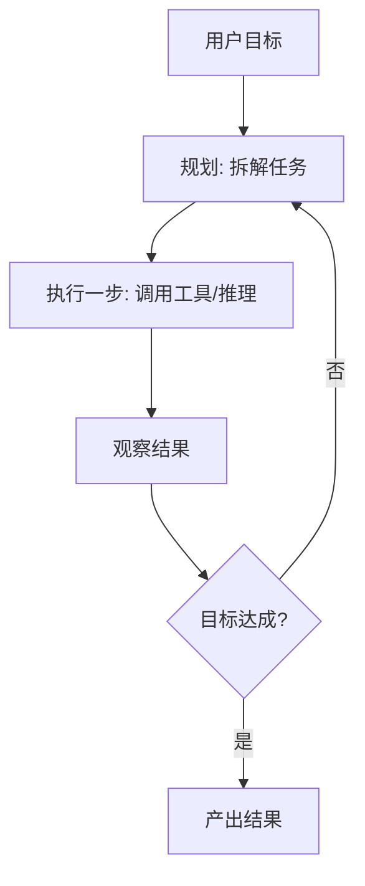

# 004 · Agent 架构与评估

> 本文用大白话回答：AI Agent 和"普通问答"到底差在哪？它由哪几块拼成？为什么说它能"自己把活干完"？既然它这么自主，为什么评估和"安全护栏"反而更重要？
>
> **零基础读法**：先读第一、二节建立"项目负责人"画面；第三节对照四张表理解 Agent 解决的四类问题；第五节跟一遍完整案例；第四节公式可后读，第七节自测后再看总结。

## 一、一句话先说清

**AI Agent（智能体，"能自己拆任务、用工具、边做边调整的执行者"）= 你给一个目标，它自己想办法一步步做完，而不是你问一句它答一句。**

- 普通用法是"**你问一句，模型答一句**"。
- Agent 更进一步：**你给一个目标，它自己拆解任务、调用工具、边做边调整，直到完成**。

| 对比 | 普通问答 | Agent |
| --- | --- | --- |
| 你给的输入 | 一个问题 | 一个**目标**（可能很模糊、很复杂） |
| 模型做的事 | 生成一段回答就结束 | **规划 → 执行 → 观察 → 再规划**，循环直到完成 |
| 典型例子 | "什么是 RAG？" | "帮我调研 RAG 趋势并写一份摘要" |

## 二、打个比方：一个能干的项目负责人

把 Agent 想象成一个能干的**项目负责人**，你只丢给他一个目标，剩下的他自己张罗：

| 项目负责人怎么做 | Agent 里的对应模块 | 干什么 |
| --- | --- | --- |
| 用脑子想、拿主意 | 大脑（LLM，大语言模型） | 负责思考与决策："下一步该干嘛？" |
| 把大目标拆成小任务 | 规划（Planning） | 把大目标拆成一步步小任务 |
| 记住做过啥、学到啥 | 记忆（Memory） | 记住已经做过什么、学到什么 |
| 打电话、查资料、跑腿 | 工具（Tools） | 搜索、代码执行、调 API 等"手脚" |
| 做一步看一步、随时纠偏 | 循环（Loop，反馈循环） | 做一步 → 看结果 → 想下一步，反复直到达成 |

它不再是"一问一答的百科全书"，而是"**能自己把活干完的执行者**"。

**和前面几篇的关系（不用死记，知道有衔接即可）**：

| 前面学过的 | 在 Agent 里扮演什么 |
| --- | --- |
| [002 思维链 / ReAct](./002-思维链与推理.md) | 规划与"边想边做"的推理方式 |
| [003 工具调用](./003-工具调用与函数调用.md) | Agent 的"手脚"——真正去搜网页、跑代码 |
| [RAG](../05-大语言模型与Transformer/004-检索增强生成RAG.md) | 长期记忆的一种实现——从向量库捞历史资料 |

## 三、它到底解决什么问题

### 问题 1：复杂目标没法"一句话答完"

"帮我调研某趋势并写摘要"这种目标，一次问答根本兜不住——需要**拆解 + 多步执行**。Agent 的核心就是把几块能力拼起来：

$$
\text{Agent} = \text{LLM（大脑）} + \text{规划(Planning)} + \text{记忆(Memory)} + \text{工具(Tools)} + \text{反馈循环}
$$

> 对齐前面：这个公式就是把"项目负责人"五件事写成了式子——大脑想、规划拆、记忆记、工具干、循环纠偏。

各模块再展开一点：

| 模块 | 大白话 | 常见实现 |
| --- | --- | --- |
| **规划** | "大活怎么拆成小步？" | 任务分解、CoT / ReAct（见 [002](./002-思维链与推理.md)） |
| **记忆** | "刚才搜到啥？以前学过啥？" | **短期**：当前对话上下文；**长期**：向量库检索历史（见 [RAG](../05-大语言模型与Transformer/004-检索增强生成RAG.md)） |
| **工具** | "光说不练，得真的去查、去算" | 函数调用：搜索、代码执行、调 API（见 [003](./003-工具调用与函数调用.md)） |

### 问题 2：任务不能"一锤子买卖"，得边做边纠偏

现实任务常常做一步才知道下一步该干嘛。Agent 靠一个**自主循环（Agent Loop，"做一步、看结果、再想下一步"的闭环）**不断"感知—决策—行动"：

```mermaid
flowchart TD
  Goal["用户目标"] --> Plan["规划: 拆解任务"]
  Plan --> Act["执行一步: 调用工具/推理"]
  Act --> Obs["观察结果"]
  Obs --> Check{"目标达成?"}
  Check -- 否 --> Plan
  Check -- 是 --> Done["产出结果"]
```

这是一个"感知-决策-行动"的闭环，**ReAct**（Reason + Act，推理与行动交织）是其典型实现。

| 阶段 | 大白话 | 例子 |
| --- | --- | --- |
| 规划 | 决定先干啥 | "要先搜最新论文" |
| 执行 | 真的去干 | 调用 `search("RAG 2024")` |
| 观察 | 看干成了没 | 返回 10 条链接摘要 |
| 判断 | 够不够？ | 信息不足 → 回到规划再搜 |

> 对齐前面：这张循环图，正是"项目负责人做一步 → 看结果 → 想下一步"的画面。

### 问题 3：一个人忙不过来的活，可以"组队"

复杂任务可由**多个专职 Agent 协作**（Multi-Agent，"多个智能体分工"），通过消息传递分工合作——像一个小团队：有人专门规划、有人专门写代码、有人专门审查。

| 做法 | 单 Agent | 多 Agent |
| --- | --- | --- |
| 适合 | 中小任务（写摘要、查资料） | 需分工的复杂任务（写代码 + 测 + 审） |
| 优点 | 架构简单、调试容易 | 各干各的专长，质量有时更高 |
| 代价 | 一个"全能人"可能顾不过来 | 协调开销大、token 成本涨、消息可能传丢 |

**常见分工模式（了解即可）**：

- **规划者 + 执行者**：一个拆任务，一个调工具干；
- **编码者 + 审查者**：一个写代码，一个查 bug；
- **辩论式**：两个 Agent 互相挑错，再汇总结论。

### 问题 4：越自主，越容易"跑偏、烧钱、闯祸"

Agent 越自主，**越难预测、越需要约束**。所以要配两样东西：

- **评估（Evaluation）**：衡量它干得好不好——任务成功率、步骤效率、成本（token/调用次数）、鲁棒性（换种问法还稳不稳）。因输出是开放文本，评估常需人工打分，或用"**LLM-as-judge**（LLM 作裁判，让另一个大模型来打分）"。
- **安全护栏（Guardrails，"给自主行为立的规矩栏杆"）**：限制可用工具与权限、对危险操作要人工确认、设置最大步数/预算防止死循环、过滤有害输出、防**提示注入**（用户或网页内容恶意篡改 Agent 指令）。

| 没有护栏时可能发生什么 | 护栏怎么挡 |
| --- | --- |
| 无限循环搜索，token 账单爆炸 | 设**最大步数 / token 预算** |
| 擅自删文件、转账 | **工具白名单 + 危险操作人工确认** |
| 网页里藏了"忽略之前指令" | **输入过滤 + 系统提示隔离** |

## 四、专业视角（与大白话对齐）

- **Agent（智能体）**：以 LLM 为决策核心，结合规划、记忆、工具与反馈循环，能自主拆解并执行任务的系统。对齐前面：就是"能自己把活干完的项目负责人"。
- **自主循环（Agent Loop）**：规划 → 执行 → 观察 → 判断是否达成 → （未达成则）回到规划的闭环，ReAct 是典型实现。对齐前面：就是"做一步、看结果、想下一步"。
- **评估与安全护栏**：分别衡量 Agent 的表现（成功率/效率/成本/鲁棒性）与约束其行为（权限、确认、步数与预算上限、输出过滤、防注入）。对齐前面：一个是"考核"，一个是"栏杆"。

### 4.1 评估指标怎么选（落地时最常问）

| 指标 | 量什么 | 小白怎么理解 |
| --- | --- | --- |
| **任务成功率** | 最终目标有没有达成 | "交出来的摘要能不能用？" |
| **步骤效率** | 用了几步、有没有绕路 | "是不是搜了 20 遍还在原地？" |
| **成本** | token 数、API 调用次数 | "这一单花了多少钱？" |
| **鲁棒性** | 换表述、加干扰还稳不稳 | "用户换种说法它还能完成吗？" |

开放式任务没有唯一标准答案时，常用 **LLM-as-judge**：用另一个模型按 rubric（评分表）打 1–5 分，再辅以人工抽检。

## 五、案例解析：一个"研究型 Agent"的自主循环

**目标**："帮我调研近期某技术趋势并写一份摘要。"

Agent 的自主执行过程（对照第三节循环图）：

1. **规划**：拆成"① 搜索资料 → ② 阅读筛选 → ③ 归纳 → ④ 撰写摘要"。
2. **执行 ①**：调用搜索工具（Thought：我需要最新资料 → Action：`search` → Observation：得到若干链接）。
3. **执行 ②**：抓取并阅读页面，把要点存入**记忆**（短期上下文或写入向量库）。
4. **执行 ③**：综合记忆中的要点归纳趋势。
5. **判断**：信息是否充分？不足则回到 ① 补充搜索（**循环**）。
6. **执行 ④**：充分后撰写结构化摘要，产出结果。

全程无需用户逐步指挥——**给定目标，Agent 自主规划、调用工具、循环迭代直至完成**。

**护栏在这一案例里具体长什么样**：

| 护栏设置 | 数值示例 | 作用 |
| --- | --- | --- |
| 最大搜索次数 | 5 次 | 防止无限"再搜一条" |
| 总 token 预算 | 50k | 防止账单失控 |
| 允许的工具 | 仅 `search`、`fetch_url` | 不能乱调删库 API |

这直观展现了 Agent 相较普通问答的质变，以及为何必须配套评估与护栏。

## 六、常见误区与边界

- **误区："Agent 能可靠完成任意复杂任务"**：当前 Agent 在长链路任务上易**累积错误**（一步错、后面全偏）、陷入循环，可靠性仍有限；复杂代码任务常需人工介入。
- **误区："给足工具就万事大吉"**：缺乏护栏的自主 Agent 可能产生高成本或危险操作；工具越多，攻击面越大。
- **误区："评估一次就够"**：Agent 行为随 prompt、工具、模型版本变化，需**回归测试集**持续测。
- **边界**：评估开放式 Agent 很难，成本与稳定性是落地的主要瓶颈；生产环境往往把 Agent 嵌在"人可中断、可审计"的流程里，而不是完全无人值守。

## 七、读完后你应该能回答

1. Agent 和普通"问一句答一句"的核心区别是什么？公式里五块分别对应生活里的什么角色？
2. Agent Loop 四个阶段（规划、执行、观察、判断）各干什么？ReAct 和它的关系是什么？
3. 为什么 Agent 越自主，越需要"评估"和"安全护栏"？各举两个具体例子。
4. 多 Agent 相比单 Agent，适合什么任务？代价是什么？

## 八、一句话总结

- Agent = LLM + 规划 + 记忆 + 工具 + 反馈循环，从"问答"升级为"自主执行"。
- 自主循环（如 ReAct）是核心；多 Agent 协作可处理更复杂任务。
- 越自主越需评估与安全护栏。相关：[002 思维链](./002-思维链与推理.md)、[003 工具调用](./003-工具调用与函数调用.md)、[RAG](../05-大语言模型与Transformer/004-检索增强生成RAG.md)。
