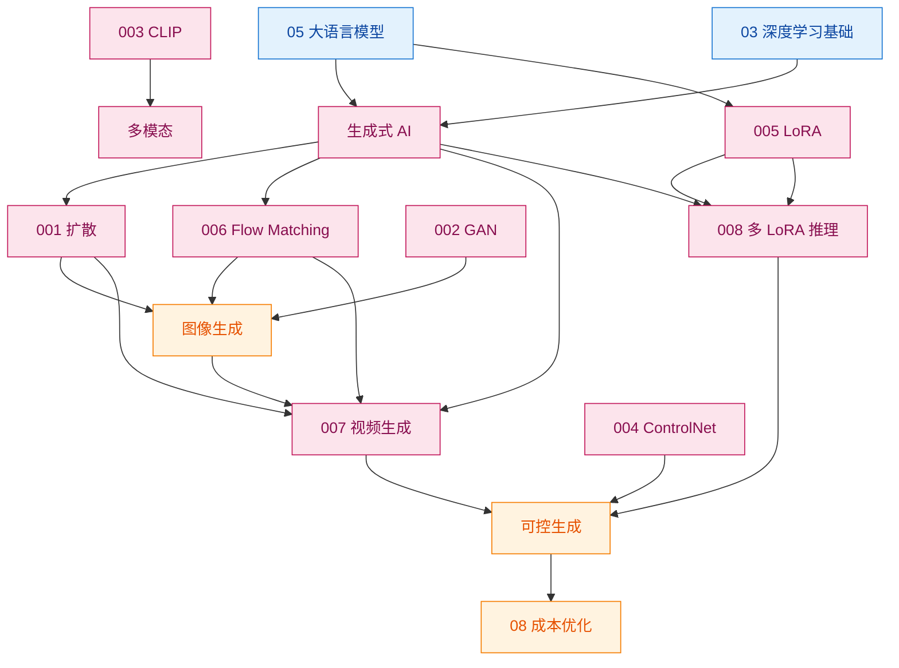

# 000 · 分类总览与知识图谱

> 本页是「生成式 AI」分类的导读，串联本分类知识点并绘制知识图谱。本分类聚焦**从数据或噪声中生成新内容**的模型与工程实践。

## 一、本分类学什么

生成式 AI 研究"**如何让机器创造新的文本、图像、音频等内容**"，而不仅是分类或预测。本分类沿「生成范式 → 多模态 → 可控与微调 → 视频与推理工程」展开：

- 当前主流图像生成范式——[001 · 扩散模型 Diffusion 基础](./001-扩散模型Diffusion基础.md)
- 经典对抗生成框架——[002 · 生成对抗网络 GAN 基础](./002-生成对抗网络GAN基础.md)
- 图文对齐与零样本视觉——[003 · 多模态 CLIP 基础](./003-多模态CLIP基础.md)
- 结构可控的文生图——[004 · ControlNet 与可控生成](./004-ControlNet与可控生成.md)
- 低成本定制风格/角色——[005 · LoRA 低秩微调](./005-LoRA低秩微调.md)
- 学流速场的生成新路线——[006 · Flow Matching 基础](./006-Flow-Matching基础.md)
- 时间维度的生成——[007 · 视频生成基础](./007-视频生成基础.md)
- 多 LoRA 叠加与部署——[008 · 多 LoRA 合并与推理实践](./008-多LoRA合并与推理实践.md)

## 二、通俗理解本分类

判别式模型回答「**这是什么**」；生成式模型回答「**能不能造一个新的**」：

- **扩散 / Flow / GAN**：造图的不同路线；
- **CLIP**：图文语义对齐；
- **ControlNet**：线稿/深度管结构；
- **LoRA**：小补丁定制画风；**多 LoRA** 像叠多张半透明贴纸；
- **视频生成**：连环画还要帧帧连贯；
- **LLM**（[05](../05-大语言模型与Transformer/000-分类总览与知识图谱.md)）生成文本。

## 三、知识图谱

## 四、学习建议

1. 基础链：001 → 002 → 003 → 004 → 005 → 006。
2. 工程链：005 LoRA → 008 多 LoRA 合并；001/006 → 007 视频生成。
3. 配合 `code/10-生成式AI/`（含 `008/.../multi_lora_merge_demo.py`）。
4. 成本与部署：[08/005](../08-AI工程与MLOps/005-成本与性能优化.md)、[08/003](../08-AI工程与MLOps/003-模型部署与推理服务.md)。

## 五、小结

- 生成式 AI 已覆盖图像（扩散/Flow/GAN）→ 可控（ControlNet/LoRA）→ 视频 → 推理工程（多 LoRA）。
- 与 LLM、CV、MLOps 紧密交叉；008 是 SD 生态最贴近日常的实践之一。
