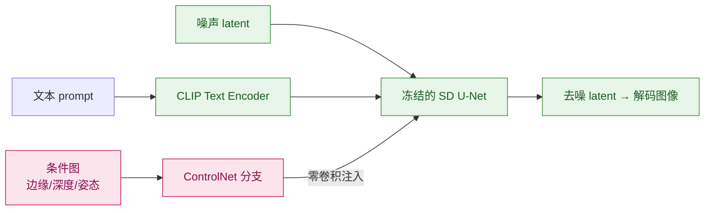

# 004 · ControlNet 与可控生成

> 本文用大白话回答：Stable Diffusion 已经能文生图了，为什么还要 ControlNet？怎么做到"照着线稿画""按深度图生成"，又不把原模型练坏？
>
> 读完你会知道：ControlNet = 给扩散模型加一条"**额外条件通道**"——线稿、深度、姿态等结构信息从旁路注入，让生成**听指挥**又不破坏原模型。

## 一、一句话先说清

**ControlNet = 复制一份预训练扩散 U-Net 的可训练副本，用"零卷积"接到原网络上，专门吃进结构条件（边缘、深度、姿态等），在去噪过程中引导最终图像按条件生成。**

Stable Diffusion 只靠文字 prompt，很难精确控制构图、人体姿势、房间布局。**ControlNet** 让你再喂一张**条件图**（如 Canny 边缘、OpenPose 骨架），生成结果会**贴合**这份结构。

## 二、打个比方：照着描红字帖练字

| 场景 | 类比 | ControlNet 对应 |
| --- | --- | --- |
| 只给题目（prompt） | 老师说"写一首关于春天的诗"，自由发挥 | 纯文生图 |
| 再给描红底 | 字帖轮廓已经印好，只能沿笔迹写 | 条件图（线稿/深度）约束结构 |
| 原字帖不能涂改 | 大模型权重冻结，不轻易改坏 | **锁定**预训练 SD 权重 |
| 另配透明描纸练 | 旁路网络专门学"怎么沿底稿写" | ControlNet 旁路分支 |

一句话：**大模型负责"画什么风格、什么内容"（文字 + 扩散）；ControlNet 负责"结构长什么样"（条件图）。**

## 三、它到底解决什么问题

### 问题 1：纯 prompt 控制不了精确结构

"一个人举起左手站在海边"——SD 可能左手变右手、人数变两个。建筑透视、产品轮廓等工业场景需要**像素级结构约束**。

| 需求 | 只靠 prompt | 加 ControlNet |
| --- | --- | --- |
| 指定人体骨架 | 不稳定 | OpenPose 条件，姿势可控 |
| 还原房间深度 | 难 | Depth 条件 |
| 产品外形一致 | 难 | Canny / 线稿条件 |

### 问题 2：直接在原模型上微调会"练坏"

若在完整 SD 上端到端微调新条件，容易**灾难性遗忘**——原来文生图质量下降。

**ControlNet 思路**：

1. **冻结**预训练 U-Net 主体（Encoder、Middle、Decoder 的可训练副本中，原路径锁死）；
2. 复制 Encoder + Middle 为 **ControlNet 分支**，输入条件图（如边缘图）；
3. 分支输出经 **零卷积（zero convolution，初始权重全 0）** 注入 Decoder 各层；
4. 训练初期注入为 0，**不破坏**原模型；随训练逐步学会贡献条件信号。

> 对齐：零卷积就像描红纸刚开始完全透明——不影响原字帖；练久了才慢慢显形引导笔迹。

### 问题 3：常见条件类型

| 条件名 | 条件图从哪来 | 典型用途 |
| --- | --- | --- |
| Canny | 原图边缘检测 | 线稿上色、风格化 |
| Depth | 深度估计模型 | 室内布局、3D 感 |
| OpenPose | 人体关键点检测 | 角色姿势控制 |
| Scribble | 用户涂鸦 | 交互式草图生成 |
| Segmentation | 语义分割图 | 区域换色、换材质 |

条件图与生成图同分辨率（或在 latent 空间对齐），与噪声 latent 一起参与去噪。

## 四、专业视角（与大白话对齐）

### 4.1 结构示意

### 4.2 训练与推理

- **训练**：文本 + 条件图 + 目标图，标准扩散去噪损失；仅更新 ControlNet（与零卷积），SD 主体冻结。
- **推理**：用户给 prompt + 条件图 +（可选）ControlNet 强度 weight；多步去噪得到结果。
- **多 ControlNet 叠加**：可同时喂 Canny + Depth，权重可调（工程上需注意冲突）。

与 [001 扩散模型](./001-扩散模型Diffusion基础.md) 的关系：ControlNet **不改变**扩散数学框架，只增加**条件注入**；文本条件仍来自 [003 CLIP](./003-多模态CLIP基础.md) 类编码器。

### 4.3 相关扩展（了解）

- **T2I-Adapter**：更轻量的条件注入，参数量小于 ControlNet；
- **IP-Adapter**：用图像 prompt 注入风格/内容；
- **LoRA**：低秩微调，常与 ControlNet 组合做角色/风格定制。

## 五、案例解析：线稿上色工作流

1. 用户提供一张产品**黑白线稿**（Canny 或手工线稿）；
2. Prompt 写 `"红色运动鞋， studio lighting, product photo"`；
3. ControlNet-Canny 权重设 0.8，SD 去噪 30 步；
4. 输出图像：**轮廓与线稿一致**，颜色与光影由 prompt 与 SD 先验填充。

若去掉 ControlNet，同 prompt 可能生成完全不同外形的产品——结构不可控。

## 六、常见误区与边界

- **误区："ControlNet 取代 prompt"**：条件图管**结构**，prompt 仍管**语义与风格**；二者配合使用。
- **误区："条件越强越好"**：权重过高会导致画面僵硬、细节丢失；需调 weight 与 guidance scale。
- **边界**：视频 ControlNet、3D 控制仍在快速演进；算力与多条件融合是工程难点（见 [08/005 成本优化](../08-AI工程与MLOps/005-成本与性能优化.md)）。

## 七、一句话总结

- ControlNet = 冻结 SD + 旁路条件分支 + 零卷积注入，实现线稿/深度/姿态等**可控**文生图。
- 与扩散、CLIP 文本条件、OpenPose/Canny 等预处理工具组成实用工作流。
- 上一篇：[003 · 多模态 CLIP](./003-多模态CLIP基础.md)；下一篇：[005 · LoRA 低秩微调](./005-LoRA低秩微调.md)；相关：[06 · 计算机视觉](../06-计算机视觉/000-分类总览与知识图谱.md)、[08/003 部署](../08-AI工程与MLOps/003-模型部署与推理服务.md)。
