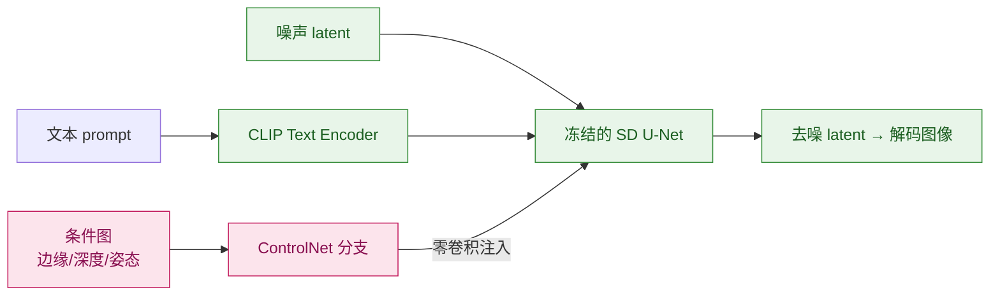

# 004 · ControlNet 与可控生成

> 本文用大白话回答：Stable Diffusion 已经能文生图了，为什么还要 ControlNet？怎么做到"照着线稿画""按深度图生成"，又不把原模型练坏？
>
> **零基础读法**：先读第一、二节建立"描红字帖"画面；第三节三张对照表看三类问题；第四节 Mermaid 图可后读；第五节跟一遍线稿上色案例；第七节自测后再看总结。
>
> 读完你会知道：ControlNet = 给扩散模型加一条"**额外条件通道**"——线稿、深度、姿态等结构信息从旁路注入，让生成**听指挥**又不破坏原模型。

## 一、一句话先说清

**ControlNet = 复制一份预训练扩散 U-Net 的可训练副本，用"零卷积"接到原网络上，专门吃进结构条件（边缘、深度、姿态等），在去噪过程中引导最终图像按条件生成。**

Stable Diffusion（SD，稳定扩散模型，见 [001 扩散模型](./001-扩散模型Diffusion基础.md)）只靠文字 **prompt**（提示词，"你希望画什么"），很难精确控制构图、人体姿势、房间布局。**ControlNet** 让你再喂一张**条件图**（如 Canny 边缘、OpenPose 骨架），生成结果会**贴合**这份结构。

| 你手里有什么 | 能控制什么 | 典型场景 |
| --- | --- | --- |
| 只有 prompt | 内容、风格、大致氛围 | "赛博朋克城市夜景" |
| prompt + 条件图 | 在以上内容之外，**结构/布局/姿势**也听你的 | 照着线稿上色、固定人物站姿 |

## 二、打个比方：照着描红字帖练字

| 场景 | 类比 | ControlNet 对应 |
| --- | --- | --- |
| 只给题目（prompt） | 老师说"写一首关于春天的诗"，自由发挥 | 纯文生图 |
| 再给描红底 | 字帖轮廓已经印好，只能沿笔迹写 | 条件图（线稿/深度）约束结构 |
| 原字帖不能涂改 | 大模型权重冻结，不轻易改坏 | **锁定**预训练 SD 权重 |
| 另配透明描纸练 | 旁路网络专门学"怎么沿底稿写" | ControlNet 旁路分支 |

一句话：**大模型负责"画什么风格、什么内容"（文字 + 扩散）；ControlNet 负责"结构长什么样"（条件图）。**

再补一个生活类比：**GPS 导航 vs 自由开车**——只有 prompt 像只告诉你"去机场"（可能绕远、走错口）；加了 ControlNet 像还给了你**必须沿哪几条路走**的路线图（结构定了，细节仍由 SD 填色）。

## 三、它到底解决什么问题

### 问题 1：纯 prompt 控制不了精确结构

"一个人举起左手站在海边"——SD 可能左手变右手、人数变两个。建筑透视、产品轮廓等工业场景需要**像素级结构约束**（每个像素大致该在哪，不能全靠模型"猜"）。

| 需求 | 只靠 prompt | 加 ControlNet |
| --- | --- | --- |
| 指定人体骨架 | 不稳定，左右手常反 | OpenPose 条件，姿势可控 |
| 还原房间深度 | 难，家具位置随机 | Depth（深度图）条件 |
| 产品外形一致 | 难，每批货形状不同 | Canny / 线稿条件 |
| 按草图布局生成 | 几乎做不到 | Scribble（涂鸦）条件 |

**条件图从哪来？** 多数不是人手画的，而是用**预处理模型**从原图或照片里算出来——例如 Canny 边缘检测、MiDaS 深度估计、OpenPose 人体关键点。这些工具在 [06 计算机视觉](../06-计算机视觉/000-分类总览与知识图谱.md) 里都有对应概念。

### 问题 2：直接在原模型上微调会"练坏"

若在完整 SD 上端到端微调新条件，容易**灾难性遗忘**（catastrophic forgetting，"学新把旧忘了"）——原来文生图质量下降，人物脸崩、风格跑飞。

| 做法 | 动谁 | 风险 |
| --- | --- | --- |
| 朴素：全模型微调 | 整个 U-Net 权重都更新 | 原 SD 能力被破坏 |
| 更好：ControlNet | **冻结**原 U-Net，只训旁路 | 原模型质量保留 |

**ControlNet 思路（四步）**：

1. **冻结**预训练 U-Net 主体（原路径权重锁死，不参与梯度更新）；
2. 复制 Encoder + Middle 为 **ControlNet 分支**，输入条件图（如边缘图）；
3. 分支输出经 **零卷积（zero convolution，初始权重全为 0 的 1×1 卷积）** 注入 Decoder 各层；
4. 训练初期注入为 0，**不破坏**原模型；随训练逐步学会贡献条件信号。

> 对齐：零卷积就像描红纸刚开始完全透明——不影响原字帖；练久了才慢慢显形引导笔迹。数学上：训练第 0 步时，注入项 $\Delta h = 0$，U-Net 行为与冻结的 SD **完全一致**。

### 问题 3：常见条件类型

| 条件名 | 条件图从哪来 | 典型用途 |
| --- | --- | --- |
| Canny | 原图边缘检测 | 线稿上色、风格化 |
| Depth | 深度估计模型（如 MiDaS） | 室内布局、3D 感 |
| OpenPose | 人体关键点检测 | 角色姿势控制 |
| Scribble | 用户涂鸦 | 交互式草图生成 |
| Segmentation | 语义分割图 | 区域换色、换材质 |
| Normal | 表面法线图 | 光照、材质一致性 |

条件图与生成图**同分辨率**（或在 **latent** 潜空间对齐），与噪声 latent 一起参与多步去噪。推理时还可调 **ControlNet 强度 weight**（0~1）：越大越贴条件图，越小越自由发挥。

## 四、专业视角（与大白话对齐）

### 4.1 结构示意

```mermaid
graph LR
  Prompt["文本 prompt"] --> TE["CLIP Text Encoder"]
  Cond["条件图<br/>边缘/深度/姿态"] --> CN["ControlNet 分支"]
  Noise["噪声 latent"] --> UNet["冻结的 SD U-Net"]
  TE --> UNet
  CN -->|"零卷积注入"| UNet
  UNet --> Out["去噪 latent → 解码图像"]

  classDef main fill:#e8f5e9,stroke:#388e3c,color:#1b5e20;
  classDef ctrl fill:#fce4ec,stroke:#c2185b,color:#880e4f;
  class UNet,TE,Noise,Out main;
  class Cond,CN ctrl;
```

> 对齐：文本走 CLIP 告诉 U-Net"画什么"；条件图走 ControlNet 旁路告诉 U-Net"结构怎样"；两者在去噪每一步汇合。

### 4.2 训练与推理

- **训练**：文本 + 条件图 + 目标图，标准扩散去噪损失（预测噪声 $\epsilon$ 或 $v$，见 [001 扩散模型](./001-扩散模型Diffusion基础.md)）；**仅更新 ControlNet（与零卷积）**，SD 主体冻结。
- **推理**：用户给 prompt + 条件图 +（可选）ControlNet 强度 weight + guidance scale（分类器自由引导强度）；多步去噪得到结果。
- **多 ControlNet 叠加**：可同时喂 Canny + Depth，各自 weight 可调；工程上需注意两种结构冲突时画面会"打架"。

与 [001 扩散模型](./001-扩散模型Diffusion基础.md) 的关系：ControlNet **不改变**扩散数学框架（仍是 $x_t \to x_{t-1}$ 去噪），只增加**条件注入**；文本条件仍来自 [003 CLIP](./003-多模态CLIP基础.md) 类编码器。

### 4.3 相关扩展（了解）

| 方法 | 大白话 | 和 ControlNet 比 |
| --- | --- | --- |
| **T2I-Adapter** | 更轻量的条件注入，参数量小 | 控制精度有时略弱，但更省显存 |
| **IP-Adapter** | 用**参考图**当 prompt，注入风格/内容 | 管"像哪张图"，不一定管像素级结构 |
| **LoRA** | 低秩微调，学特定画风/角色 | 常与 ControlNet **组合**：结构靠 ControlNet，风格靠 LoRA（见 [005 LoRA](./005-LoRA低秩微调.md)） |

## 五、案例解析：线稿上色工作流

1. 用户提供一张产品**黑白线稿**（Canny 从照片提边缘，或设计师手工线稿）；
2. Prompt 写 `"红色运动鞋， studio lighting, product photo"`；
3. ControlNet-Canny **weight** 设 0.8（较贴线稿），SD 去噪 30 步；
4. 输出图像：**轮廓与线稿一致**，颜色与光影由 prompt 与 SD 先验填充。

| 参数 | 设太低 | 设太高 |
| --- | --- | --- |
| ControlNet weight | 结构跑偏，像纯文生图 | 画面僵硬、缺细节 |
| guidance scale | 不太听 prompt | 过饱和、伪影增多 |

若去掉 ControlNet，同 prompt 可能生成完全不同外形的产品——结构不可控。工业场景（电商主图、游戏资产）因此常把 ControlNet 当标配。

## 六、常见误区与边界

- **误区："ControlNet 取代 prompt"**：条件图管**结构**，prompt 仍管**语义与风格**；二者配合使用。线稿定了"鞋形"，prompt 定"红色、棚拍光"。
- **误区："条件越强越好"**：权重过高会导致画面僵硬、细节丢失；需调 weight 与 guidance scale 找平衡。
- **误区："任意条件图都能用"**：条件图分辨率、预处理质量差会直接反映到生成结果；OpenPose 漏检关节会导致肢体扭曲。
- **边界**：视频 ControlNet、3D 控制仍在快速演进；算力与多条件融合是工程难点（见 [08/005 成本优化](../08-AI工程与MLOps/005-成本与性能优化.md)）。

## 七、读完后你应该能回答

1. ControlNet 解决的核心问题是什么？为什么"直接微调整个 SD"不是好主意？
2. "零卷积"在训练刚开始时起什么作用？用描红字帖怎么理解它？
3. Canny、Depth、OpenPose 三种条件分别控制什么？各适合什么场景？
4. 线稿上色工作流里，prompt 和 ControlNet 各管什么？weight 太高会怎样？

## 八、一句话总结

- ControlNet = 冻结 SD + 旁路条件分支 + 零卷积注入，实现线稿/深度/姿态等**可控**文生图。
- 与扩散、CLIP 文本条件、OpenPose/Canny 等预处理工具组成实用工作流。
- 上一篇：[003 · 多模态 CLIP](./003-多模态CLIP基础.md)；下一篇：[005 · LoRA 低秩微调](./005-LoRA低秩微调.md)；相关：[06 · 计算机视觉](../06-计算机视觉/000-分类总览与知识图谱.md)、[08/003 部署](../08-AI工程与MLOps/003-模型部署与推理服务.md)。
